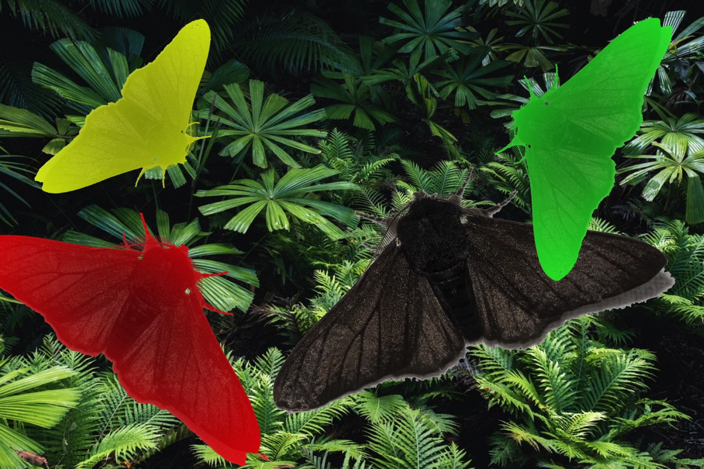
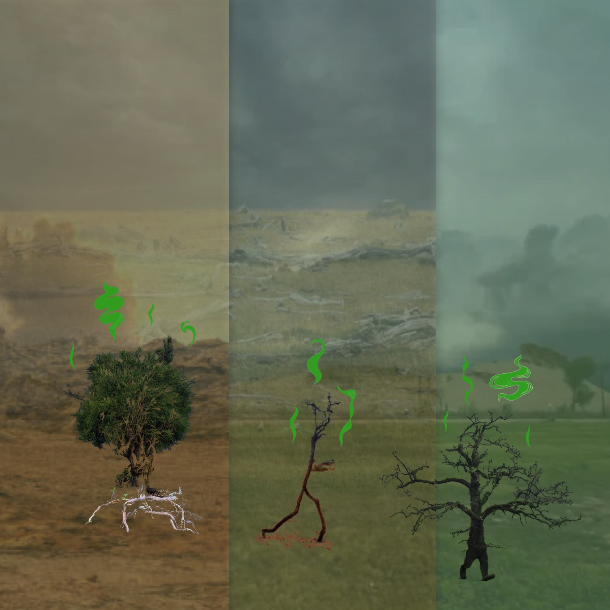
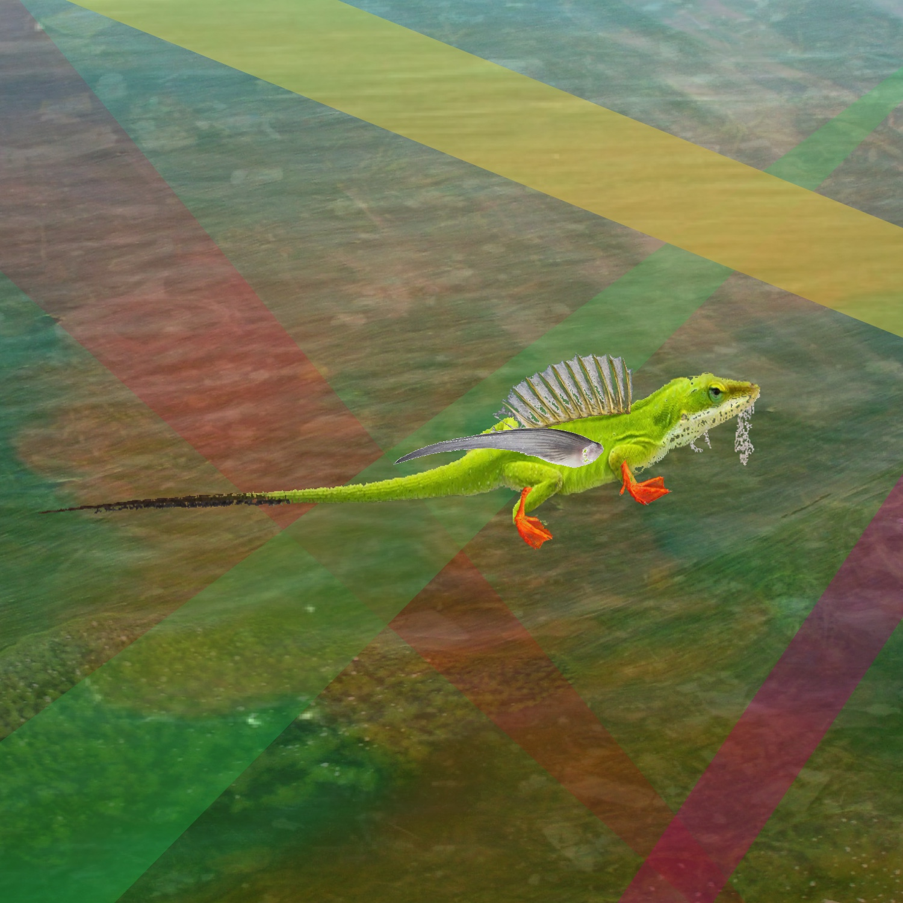

public:: false

- [[Album empreintes DIGITALes 2022]]
- __More plants + giant colored peppered moths__
  background-color:: #793e3e
	- If humans were to go extinct, our carbon emissions could still remain in the air for a long time. *__That could lead to boom times for plants, some of which can thrive in a CO2-dense atmosphere.__* The increased density and diversity of plants, in turn, might eventually increase the concentration of oxygen in the atmosphere. Researchers have hypothesized that the growth of insects depends in part on the concentration of oxygen in the atmosphere, *__which could lead to insects developing larger bodies__*
	  https://www.vox.com/down-to-earth/22734772/future-animals-evolution-unexplainable
	- Plants thrive on CO2, but it's more complicated than that #CO2 #plants -> https://news.climate.columbia.edu/2022/01/27/how-climate-change-will-affect-plants/
	- Insects that become giants due to excess oxygen (hypothesis) #insect -> https://www.nationalgeographic.com/science/article/110808-ancient-insects-bugs-giants-oxygen-animals-science?loggedin=true
	- Peppered moth -> Camouflage in response to pollution during the industrial revolution (trees became blackened by soot) -> __imagining faster evolution and adaptation to various colors__
	  https://en.wikipedia.org/wiki/Peppered_moth_evolution
- 
- __Tiny smelly walking trees __
  background-color:: #793e3e
	- Varieties thyme with __stronger smelling compounds like phenols to deter herbivores.__
	  https://www.smithsonianmag.com/science-nature/ten-species-are-evolving-due-changing-climate-180953133/
	- Trees that move across the forest as the growth of new roots gradually relocates them (because of eroding soil and better sunlight), sometimes two or three centimetres per day.
	  https://www.bbc.com/travel/article/20151207-ecuadors-mysterious-walking-trees
	- Himalayan snow lotus -> Human harvesting of larger individuals of a rare plant for medicinal purposes __resulted in the rapid evolution of smaller individuals__ over only 100 years.
	  https://www.pnas.org/doi/10.1073/pnas.0502931102
- {:height 784, :width 776}
- __Pollution-resistant (aquatic) long-legged anoles__
  background-color:: #793e3e
  id:: 62b4eb82-6596-4c61-ad61-f5309dda7ab7
	- Puerto Rican crested anole lizard -> And we see that in the cities, __the legs have become longer and they have obtained more of these lamellae under their feet.__
	  https://e360.yale.edu/features/urban-darwinism-how-species-are-evolving-to-survive-in-cities
	- Atlantic tomcod -> __pollution-resistant__ (PCBs and dioxin)
	  https://www.npr.org/2011/02/17/133842089/toxic-avengers-pollution-drove-fish-evolution
	- __The distant future is likely to be more watery,__ as sea-level rise decreases the portion of the planet covered by dry land. Some animals might take to living in more marine environments.
	  https://www.vox.com/down-to-earth/22734772/future-animals-evolution-unexplainable
	- 