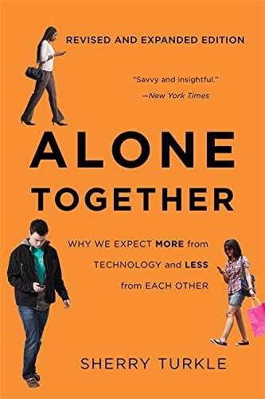

public:: true

- Alone Together: Why We Expect More from Technology and Less from Each Other
- {:height 468, :width 297}
- Turkle, S. (2017). Alone Together: Why We Expect More from Technology and Less from Each Other. Basic Books.
-