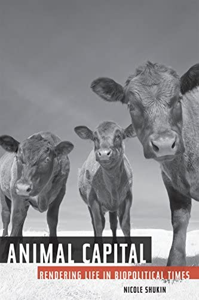
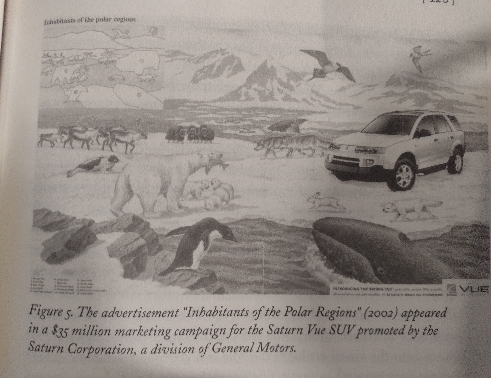

- Animal Capital: Rendering Life in Biopolitical Times
- {:height 478, :width 312}
- Shukin, N. (2009). *Animal Capital: Rendering Life in Biopolitical Times*. Univ Of Minnesota Press.
- Introduction - New Life Forms and Functions of Animal Fetishism
	- "What makes animal signs unusually potent discursive alibis of power is not only that particularist political ideologies, by ventriloquizing them, appear to speak from the universal and disinterested place of nature." (pp. 5) #power #powerdynamics
	- "As Cary Wolfe writes, 'as long as it is institutionally taken for granted that it is all right to systematically exploit and kill nonhuman animals simply because of their species, then the humanist discourse of species will always be available for use by some humans against other humans as well, to countenance violence against the social order of whatever species-or gender, or race, or class, or sexual difference.'" (pp. 10) #speciesism #powerdynamics
	- "Not only automotive corporations but telecommunication corporations as well appear to favor animal signs as affective technologies." (pp. 42) #affect
	- "Yet if human-animal intimacy  is pathologized in the cultural discourse of pandemic, it is contradictorily fetishized as an object of desire in concurrent cultural discourses. (pp. 46)
- 1_ Rendering's Modern Logics
	- "Rendering also connotes 'the faculty to copy, imitate, make model,' as in the practice of rendering an object's likeness in this or that medium. Yet rendering simultaneously denotes the industrial business of boiling down and recycling animal remains, with the aim of returning animal matter to another round in the marketplace. In the Introduction I termed this a 'double entendre' of rendering, noting that while rendering has multiple senses, the accommodation of these two particularly divergent logics within the space of its one signifier __is deeply suggestive of the complicity of representational and material economies in the reproduction of (animal) capital.__" (pp. 50-51)
	- "Feminists have long criticized Marx for having overlooked the unpaid domestic, sexual, and affective labors of women in the reproduction of the conditions of production, __a critique that it is now clear also concerns other species-and they are legion-whose lives have become coextensive with the ecological conditions of capital.__" (pp. 80)
- 2_ Automobility: The Animal Capital of Cars, Films, and Abattoirs
	- "Among the biopolitical aims pursued through early tours of the stockyards, after all, was that of persuading a nation to desire meat as a regular part of its diet. The affective sights, sounds, and smells generated through what was then, according to its booklet, Swift and Company's slaughter of "twenty-five hundred cattle, seven thousand hogs and seven thousand sheep per day" thus needed to be carefully managed to prevent moments of human-animal identification from triggering metabolic revolt in tour-goers (causing them to sicken rather than salivate at the prospect of meat) or political exception to the rationalized slaughter of animals." (pp. 96)
	- "It is doubtful that Swift and Company would have risked such a wager-would have dared manage against the dangerous slippage between human and animal in the space of slaughter via the subject whose social powerlessness strongly invites the substitution-with a little colored girl, whose racialization has historically involved mistaking her for an animal. The mutual coding of whiteness and humanness is pivotal to the success of the mimetic management operated by
	  the figure of the little girl. Swift and Company thus communicate their supreme confidence
	  in the absolute difference of human and animal by giving the little girl license, in their illustrations, to play on the physical barrier dividing human and animal. Her starched white dress-matched with a white hat of the sort worn by head chefs (demarcating the power of the one who eats from that of the one who is eaten)-further amplifies her humanness as an impenetrable barrier that secures against human-animal slippage in the slaughterhouse." (pp. 98) #powerdynamics #anthropocentrism #whitesupremacy #whiteness
	- "Immuring wildlife on film was widely framed as a conservationist act; over a century later, the valorization of celluloid's conservationist logic still informs the cinematic theory of Lippit, who rearticulates film as a 'virtual shelter for displaced animals.'" (pp. 108) #camera
	- "The aesthetic interest generated by crossing animals and automobile (not to mention woman) at this biopolitical intersection is profoundly at odds with cars' ecological exploits and impacts" (pp. 117)
	- "The taxonomic system of classification mimicked by the ad presents a synchronic cross-section of a state of nature, of naturally occurring biodiversity. As a synchronic slide, the ad presents a timeless 'still,' a representative range of animal life outside of contingent historical forces such as human management and exploitation."
	- 
	- "A discourse of technological progress encoded in the digital sharpness of the Vue subtly distinguishes it from the surroundings wildlife with whom it at first seems to coexist. The wildlife is, in effect, demoted in the ecological hierarchy by the heightened representationsl fidelity of the SUV." (pp. 124) #hierarchies
	- "While roadkill is perhaps more emblematic of the violence at material intersections of animal and automobile, car culture materially displaces animals in far more systematic ways as well, through the infrastructures of roads and highways that transect animal habitat and through the incalculable costs of fossil fuel extraction." (pp. 126)
	- "At the beginning of this chapter I remarked that critiques that have taken humans (and in the Marxian tradition, workers) as the focal subjects of material history leave a whole biopolitical terrain of animal signs and substances-massively productive for cultures of capital-unexamined." (pp. 128)
	- "Even more than the most unintelligible figures of human life and precarity-subaltern women-animals suffer the double binds of representation: they are either excluded from the symbolic order on the grounds of species difference, or anthropomorphically rendered within it." (pp. 129) #anthropomorphism
- 3_ Telemobility: Telecomunication's Animal Currencies
	- Galvani, Edison, Telus
	- Electrical tests on animals + communication/affect -> "A canonical figure of the undead animal takes shape across heterogeneous texts that in different
	  ways consign animals to a spectral existence outside of the possibility of language, time, and history-in short, outside of the horizon of death. Like unconscious wishes, writes Lippit, animals 'are indestructible, undying, they are recycled constantly throughout the world'." (pp. 134)
	- "The idea that a technological power of virtual communication becomes visible through the material analogy of animal life presupposes that animal life is itself transparent [...]. The notion that animals are capable only of a physical 'system of signaling' and a 'prewired response' saturates not only the Cartesian worldview inherited by Galvani but persists, as Derrida argues, in contemporary philosophical, psychoanalytical, and scientific discourses." (pp. 141-142) #animalmachine #speciesism
	- "What Mary Shelley would fictionalize in Frankenstein had already been attempted by Galvani: a necromancy with dead nature's carnal parts and an obsession with achieving knowledge and control of life via knowledge and control of electricity." (pp. 143)
	- "Though it never fulfilled its practitioners' hopes of reanimating the dead, the spectacle of galvanism nevertheless played an important role in producing life as a mimetic effect indifferent to the biological distinction between living and dead matter. [...] His discourse of animal electricity simultaneously allowed for absolute distinctions between animal and human (the only ideological
	  stance capable of justifying experiments on animals that would be unthinkable on a European humanity, with the exception, among other things, of criminal corpses) and the collapse of physiological differences between bodies as different as humans and amphibians (what was tested on frog legs could be therapeutically used on humans)." (pp. 146) #animalmachine
	-