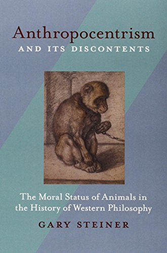

- Anthropocentrism and its Discontents
- {:height 487, :width 313}
- Steiner, G. (2005). *Anthropocentrism and its Discontents*. University of Pittsburgh Press.
- Descartes on the Moral Status of Animals (pp. 132–152).
	- "For centuries a certain conventional wisdom prevailed concerning Descartes's views about animals. He was long assumed to maintain not simply that animals are morally inferior to human beings, but that they are in fact due no moral obligations whatsoever. On this view, Descartes was able to justify such practices as vivisection on the grounds that non-human animals are mere machines." (pp. 132) #animalmachine #speciesism
	- "On the strongest readings of Descartes's "monstrous" thesis, Descartes's denial of feeling in animals is a fundamental basis for his denying that animals have moral worth." (pp. 133)
	- "But in recent years a controversy has emerged regarding Descartes's views on animals. Several commentators have sought to overturn this conventional wisdom as a simple misreading of Descartes's views." (pp. 133)
	- "[...] the views of thinkers like Cottingham, Harrison, and Gaukroger are based on a selective reading of Descartes's remarks about animals and tend to ignore the spirit of his philosophy and his call for human beings to render themselves "the masters and possessors of nature." It must be granted that Descartes never formally and definitively declares that animals are mere resources that we may use as we wish; but he says enough to make it clear that he considers animals to be of an inferior rank to humans in the order of creation, and that he considers animal experimentation to be an acceptable practice." (pp. 134) #anthropocentrism #supremacy #hierarchies
	- "[...]  Descartes presents an ontology according to which immaterial things are superior to material ones. Embodiment is a sign of imperfection; the less dependent a being is on corporeality, the more perfect the being is."' Any being that is wholly corporeal is of the lowest order of being; and given Descartes's appeal to mechanism as the means for representing or explaining corporeality, this means that any being that can be explained exhaustively in mechanistic terms is of the lowest order of being. " (pp. 135) #hierarchies
	- "In the following discussion, I demonstrate the link between Descartes's commitment to the mastery of nature and his views on the moral status of animals: Nature is taken in its essence to be pure corporeality, which for Descartes is fully explicable in terms of inert mechanism. Whatever is pure corporeality or mechanism is not worthy of moral respect, and this allows human beings to treat nature as a storehouse of energy and raw materials that are available for the satisfaction of human desires." (pp. 135) #humansupremacy
	- "Notwithstanding the distinctive contribution that Descartes's conception of mechanism makes to the historical project of using nonhuman beings for the satisfaction of human needs, Descartes's conviction that we have no duties toward animals is wholly in accordance with a tradition of think-ing about animals that extends back to antiquity. " (pp. 135) #humansupremacy #mechanisms #nonhuman
	- "By appealing to a strict dualism, Descartes reduces animals to pure mechanism and categorically rejects the idea that we have any kind of duties toward animals. For Descartes, human beings and animals differ not simply in degree but in kind, and humans are fundamentally superior to animals." (pp. 138) #dualism #humansupremacy
	- "Like the tradition of philosophers before him, Descartes bases his commitment to the inferiority of animals on the fact that animals lack speech (Xoyog) in the sense of rational discourse. Descartes, like his predecessors, believes that language use is a sign that the being in question is rational, and that conversely the inability to use language is a sign that the being in question is not rational. " (pp. 138) #language #hierarchies
	- "What Descartes is at pains to show here is precisely what certain of his contemporaries were not willing to accept: Descartes wants to argue that animals are different than human beings not simply in degree but in kind, in virtue of the fact that animals lack the faculty of reason or thought whereas human beings possess it." (pp. 139) #humansupremacy
	- " [...] he concludes that his 'opinion is not so much cruel to animals as it is indulgent to human beings . . . since it absolves them from the suspicion of crime when they eat or kill animals.'" (pp. 142) #speciesism
	- "In this connection, I now consider the extent to which Descartes's dualism is informed by his Greek and particularly his Christian heritage; for even if animals can be said to possess souls, these souls are fundamentally so different from human souls that any comparison of the two is dangerously misleading. Among earthly beings, only those possessing immortal souls (namely human beings) are destined to enter the city of God; all other beings, even if they possess some kind of soul other than an immortal one, are consigned to the function of serving human needs. To this extent, Descartes argues that animals are just like any other natural resource. Just as did Aristotle, the Stoics, Augustine, and Aquinas before him, Descartes believes that human beings may kill and eat animals without any moral scruple whatsoever." (pp. 142-143) #christianity #hierarchies #speciesism
	- "To say that animals possess corporeal souls is to attribute to them a moral status akin to that of plants, which are also alive and which, according to the Aristotelian-Thomistic tradition, themselves possess a certain kind of 'soul.' The notion of a corporeal soul is entirely compatible with Descartes's reduction of animals to pure mechanism, inasmuch as, for Descartes, 'animal souls [are] reduced to the configuration of the parts of their bodies.' In principle, animals are simply part of a larger sphere of mechanistic, material resources; only human beings with immortal souls are due moral respect. " (pp. 144) #aliveness #speciesism #plants
	- " [...] his views about sensation and morality make it clear that his position is this: All and only those beings that are reflectively aware of their sensations or feelings are the kind of beings that belong to moral community. [...] Hence even Descartes's views about feeling in animals as opposed to human beings return us to the criterion of rationality. " (pp.. 145) #rationality #sentience
	- "Cottingham maintains that even if animals are mechanisms, if they are capable of feeling in any sense then they must be aware of their feelings—they cannot, as Smith had maintained, be unfeeling machines and nothing more." (pp. 145) #sentience #animalmachine
	  background-color:: #978626
	- "Cottingham and Gaukroger present us with contemporary versions of Gassendi's claim that perceptual states, in their very nature, include some kind of conscious awareness." (pp. 146) #awareness
	- "Where, on Descartes's view, the flight of the sheep is essentially no different from, say, the rising of mercury in a thermometer in response to an increase in temperature, my flight in the face of a wolf includes an awareness of the wolf as a threatening object in relation to me as a subject. " (pp. 147)
	- "Hence human beings, __as a composite of mind (soul) and body__, are subject to the same sorts of bodily desires as animals, but are able to reflect on those desires and render them (or supplant them with) 'reasonable loves, hates, and desires.'" (pp. 150)
	- "The essence of Descartes's reasoning is not so much that animals are incapable of feeling pain as that they lack any kind of awareness. In the final analysis, animals are incapable of feeling precisely because they lack consciousness, and they lack consciousness because God did not give them immaterial souls. In contrast, the possession of consciousness, which for Descartes is coextensive with the possession of rationality, qualifies human beings as beings with moral worth." (pp. 151) #awareness #rationality
	- "This in turn grants human beings the license to manipulate nature in any way they wish, provided that their actions promote the welfare of mankind. By viewing animals as pure mechanism, Descartes reduces them to mere means for the end of human happiness." (pp. 152) #humansupremacy
- Contemporary Debates on the Status of Animals (pp. 4-37)
	-