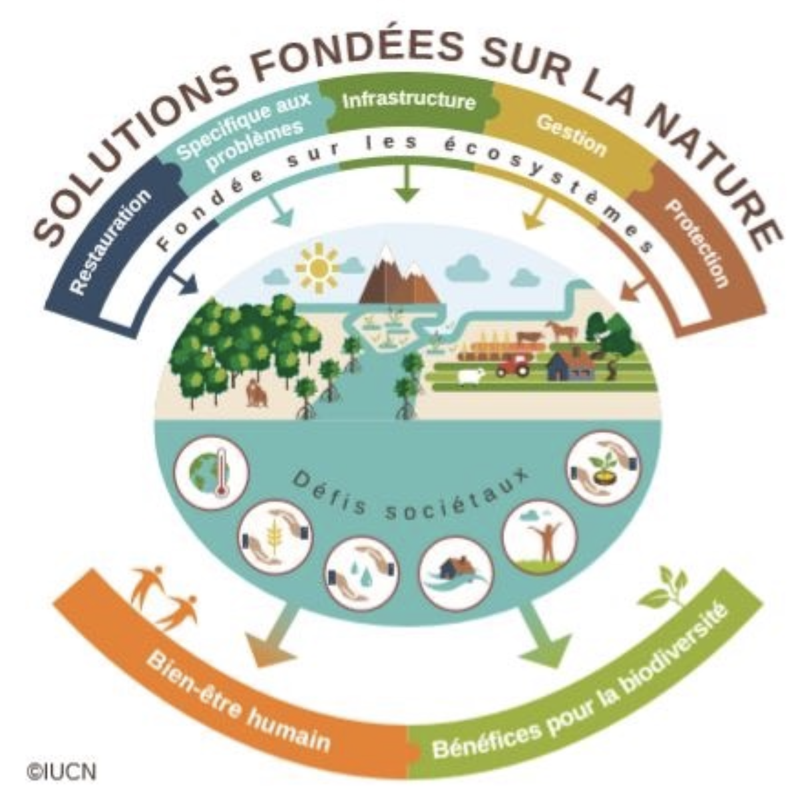

public:: false

- [[DM1L]]
- ******************************
- CONCEPT = __PROPRIÉTÉ__, capitalisme, anthropocentrisme, relations de pouvoir, écosystèmes
  background-color:: #497d46
	- Oeuvre nommée : Propriété
	- 20221212 - points principaux
	  background-color:: yellow
		- propriété = les gens s'en font pour l'environnement lorsque ça touche leur investissement financier
		- stéréotypie = "A stereotypy is a term for a group of phenotypic behaviours that are repetitive, morphologically identical and which possess no obvious goal or function." https://en.wikipedia.org/wiki/Stereotypy_(non-human)
		- considération du monde animal = captivité
		- considération du monde animal = territoire habitable rétrécit
		- La vision (souvent négative) que l'être humain a sur la faune et flore vivant sur le même territoire que lui. En particulier, les êtres vivants qui ne correspondent pas à nos standards esthétiques ou qui "compétitionnent" avec nous sur le territoire.
		- Une volonté de changement de paradigme, pour une coexistence plutôt qu'une guerre contre ces êtres vivants.
		-
	-
	-
	-
	- Petit aquarium cube sur un podium noir, micro écosystème à l'intérieur du cube
		- Captivité
		- Représente le pouvoir qu'on a (en tant qu'être humain) sur l'écosystème
		- Le titre change complètement notre perception de l'oeuvre : on y voit différents être "vivants", différents éléments "naturels", un écosystème, mais le titre nous informe que ceci appartient à quelqu'un
	- OU
	- Gros cube vitré, écosystème qui rempli le cube
		- Captivité
		- (même caractéristiques que l'option précédente, sauf que)
		- L'oeuvre est plus ample
		- S'accote sur les parois(??)
		  background-color:: #793e3e
		-
	- L'écosystème est fait de :
	  background-color:: #978626
		- Petits robots mouvants (issus du projet de session maîtrise) -> à voir s'ils devraient bouger, mais non se déplacer afin de pouvoir les brancher au courant (éviter les batteries)
			- S'ils sont branchés, ils pourraient tout de même se déplacer...
			- Peuvent représenter : algues, plantes aquatiques, plantes terrestres, insectes, poissons, grenouilles, castor, etc.
		- Autres éléments représentant : eau, arbres, plantes, terre, roches, etc.
		-
	- Idée globale :
	  background-color:: #264c9b
	- Les enjeux liés aux algues bleu-vert sont indéniablement synonymes d'enjeux environnementaux. Or, bon nombre de résident.e.s riverain.e.s font mention de termes comme 'valeur', 'investissement' et 'générations futures' non pas seulement en terme de souci écologique, mais également (voire, surtout) en terme d'investissement financier.
	- Ce projet aborde l'écosystème comme propriété. Il questionne la vision capitaliste de la nature qui nous permet (en tant qu'être humain) de nous dissocier de celle-ci et de la posséder individuellement.
	- L'oeuvre aborde la problématique entourant la vision de la nature comme ressource à exploiter.
	  background-color:: #497d46
	- L'oeuvre vise à présenter l'écosystème sur une échelle miniature en mettant l'emphase sur l'état de captivité et notre rôle (potentiellement positif et/ou négatif) sur celui-ci.
	- 
	- Les bénéfices pour la biodiversité doivent avoir un poids égal à celui du bien-être humain
-
- POUR LE ROBOT/CIRCUIT
	- Mettre dans l'eau distillée
	- Enduire de vernis à ongles transparent
- ************************
-
- "Many of these algal blooms, not all of them, but many of them are fantastic little creatures *__that have the characteristics of both a plant and an animal,__* in the sense that they can both ingest microbes and make a meal of the bacteria and viruses that are around, and they can photosynthesize. So, they can do both in terms of securing nutrition." Lesley Green https://multispeciesworldbuilding.com/lesley-green-2/
- Atlas de l'eau https://environnement.gouv.qc.ca/eau/atlas/atlas-argis/index.html?extent=-10128033.7325%2C5299302.4267%2C-6371000.9182%2C7106885.2715%2C102100&showLayers=Suivis_en_lacs_2004_%C3%A0_2020_dec2021_6625%3BSuivis_en_lacs_2004_%C3%A0_2020_dec2021_8120%3BSuivi_en_lacs_8897%3BSDA_WMS_8004_2726_9652_4282_0%3BSDA_WMS_8004_2726_2%3BSDA_WMS_8004_2726_9652_1%3BSDA_WMS_8004_4
- Le lac Ste-Anne est un lac oligotrophe : Lac pauvre en éléments nutritifs, qui possède donc des eaux très claires et généralement profondes. On y retrouve peu de végétaux et son bassin versant est relativement petit. https://obvaj.org/citoyens/les-bonnes-pratiques/eutrophisation/
- Take for instance what is referred to as cyanobacteria. Known commonly as blue-green algae, colonies of these photosynthetic bacteria represent some of the earliest evidence of life in the fossil record. Remains of colonial blue-green algae have been found in rocks dating back more than 4 billion years. As a whole, these types of fossils represent nearly 7/8th of the history of life on this planet! __However, they are considered bacteria, not plants.__ https://www.indefenseofplants.com/blog/2018/2/20/are-algae-plants
- Whatever their color, cyanobacteria are photosynthetic, and so can manufacture their own food. This has caused them to be dubbed "blue-green algae", __though they have no relationship to any of the various eukayotic algae.__ The term "algae" merely refers to any aquatic organisms capable of photosynthesis, and so applies to several groups. https://ucmp.berkeley.edu/bacteria/cyanolh.html
- Swarm behaviour
	- **Swarm behaviour**, or **swarming**, is a [collective behaviour](https://en.wikipedia.org/wiki/Collective_animal_behaviour) exhibited by entities, particularly animals, of similar size which aggregate together, perhaps milling about the same spot or perhaps moving *en masse* or [migrating](https://en.wikipedia.org/wiki/Animal_migration) in some direction. It is a highly interdisciplinary topic. https://en.wikipedia.org/wiki/Swarm_behaviour
- Swarm intelligence
	- **Swarm intelligence** (**SI**) is the [collective behavior](https://en.wikipedia.org/wiki/Collective_behavior) of [decentralized](https://en.wikipedia.org/wiki/Decentralization), [self-organized](https://en.wikipedia.org/wiki/Self-organization) systems, natural or artificial. SI systems consist typically of a population of simple [agents](https://en.wikipedia.org/wiki/Intelligent_agent) or [boids](https://en.wikipedia.org/wiki/Boids) interacting locally with one another and with their environment.[[2]](https://en.wikipedia.org/wiki/Swarm_intelligence#cite_note-tcds-2) The inspiration often comes from nature, especially biological systems. The agents follow very simple rules, and although there is no centralized control structure dictating how individual agents should behave, local, and to a certain degree random, interactions between such agents lead to the [emergence](https://en.wikipedia.org/wiki/Emergence) of "intelligent" global behavior, unknown to the individual agents.[[3]](https://en.wikipedia.org/wiki/Swarm_intelligence#cite_note-tro-3) Examples of swarm intelligence in natural systems include [ant colonies](https://en.wikipedia.org/wiki/Ant_colony), [bee colonies](https://en.wikipedia.org/wiki/Bee_colonies), bird [flocking](https://en.wikipedia.org/wiki/Flocking_(behavior)), hawks [hunting](https://en.wikipedia.org/wiki/Hunting), animal [herding](https://en.wikipedia.org/wiki/Herding), [bacterial growth](https://en.wikipedia.org/wiki/Bacteria#Growth_and_reproduction), fish [schooling](https://en.wikipedia.org/wiki/Shoaling_and_schooling) and [microbial intelligence](https://en.wikipedia.org/wiki/Microbial_intelligence). https://en.wikipedia.org/wiki/Swarm_intelligence#Swarmic_art
- Intelligence distribuée
	- L'**intelligence distribuée**, appelée aussi **intelligence en essaim**, désigne l'apparition de phénomènes cohérents à l'échelle d'une population dont les individus agissent selon des règles simples. L'[interaction](https://fr.wikipedia.org/wiki/Interaction) ou la [synergie](https://fr.wikipedia.org/wiki/Synergie) entre actions individuelles simples peut de façons variées permettre l'[émergence](https://fr.wikipedia.org/wiki/%C3%89mergence) de [formes](https://fr.wikipedia.org/wiki/Morphog%C3%A9n%C3%A8se), [organisations](https://fr.wikipedia.org/wiki/Auto-organisation), ou comportements collectifs, complexes ou cohérents, tandis que les individus eux se comportent à leur échelle indépendamment de toute règle globale. https://fr.wikipedia.org/wiki/Intelligence_distribu%C3%A9e
- Swarm robotics
	- **Swarm robotics** is an approach to the coordination of multiple robots as a system which consist of large numbers of mostly simple physical [robots](https://en.wikipedia.org/wiki/Robot). It is supposed that a desired [collective behavior](https://en.wikipedia.org/wiki/Collective_behavior) emerges from the interactions between the robots and interactions of robots with the environment. This approach emerged on the field of [artificial swarm intelligence](https://en.wikipedia.org/wiki/Artificial_swarm_intelligence), as well as the biological studies of insects, ants and other fields in nature, where [swarm behaviour](https://en.wikipedia.org/wiki/Swarm_behaviour) occurs. https://en.wikipedia.org/wiki/Swarm_robotics
-
- Brainstorm concept
	- Le rôle/impact des cyanobactéries dans l'écosystème (comprenant les autres êtres vivants dans et autour du lac, animaux, plantes, humains)
	- La vision (souvent négative) que l'être humain a sur la faune et flore vivant sur le même territoire que lui. En particulier, les êtres vivants qui ne correspondent pas à nos standards esthétiques ou qui "compétitionnent" avec nous sur le territoire.
	- Une volonté de changement de paradigme, pour une coexistence plutôt qu'une guerre contre ces êtres vivants.
	- Je veux donc mettre ces êtres vivants de l'avant et les présenter de manière inhabituelles et comme "personnages principaux".
	- Ensemble de robots, swarm behaviour/intelligence
- Questions scientifiques
  background-color:: #978626
	- Considère-on les cyanobactéries/algues bleu-vert comme des animaux ou comme des plantes? Ou des bactéries? Pourquoi alors le nom algues bleu-vert? Les algues sont-elles des plantes ou une toute autre chose?
- Questions pour les résidents du lac Sainte-Anne
  background-color:: #264c9b
	- Depuis combien de temps vivez-vous autour du lac? Quels changements avez-vous observé (par rapport à l'environnement, la faune, la flore)?
	- Quelles actions sont prises au lac pour le protéger des algues bleu-vert? Comment participez-vous à ces actions? À votre connaissance, les actions sont-elles effectuées par la majorité des riverains?
	- Qu'est-ce qui vous inquiète le plus/vous tient le plus à coeur lorsqu'on parle de protection du lac (enjeux environnementaux, économiques, sociaux, esthétiques, etc.)?
	- Outre le lac, vous impliquez-vous d'autres manières par rapport à des enjeux environnementaux et/ou sociaux (actions personnelles, organisations, etc.)?
	-
	- Selon les documents, il n'y a pas de plantes envahissantes dans le lac. Y a-t-il des animaux ou autres que vous considérés tout de même envahissants (par exemple, castor)? Quelle est votre relation à la faune et la flore en général?
	-
	- RÉPONSES
	  background-color:: #793e3e
		- Guylaine et Robert
			- Moins de grenouilles et de sangsues qu'avant
			- Quelqu'un a introduit l'achigan à un moment donné = mange des grenouilles
			- Trappage de castor -> lac trop bas (problème pour les pontons) -> doit construire une digue
		- Sylvianne
			- Valeur des terrains est importante (pour ses enfants, entre autres)
		- Geneviève
			- Motivations environnementales
			- La cause économie fait avancer la cause environnementale...
			- Rive = provinciale, eau = fédéral
-
- 2022/09/26
	- Le BEAMbot dans l'eau distillée et couvert de vernis transparent fonctionne encore après deux jours dans l'eau
- 2022/10/24
	- Stéréotypie = "A stereotypy is a term for a group of phenotypic behaviours that are repetitive, morphologically identical and which possess no obvious goal or function." https://en.wikipedia.org/wiki/Stereotypy_(non-human)
	  background-color:: purple