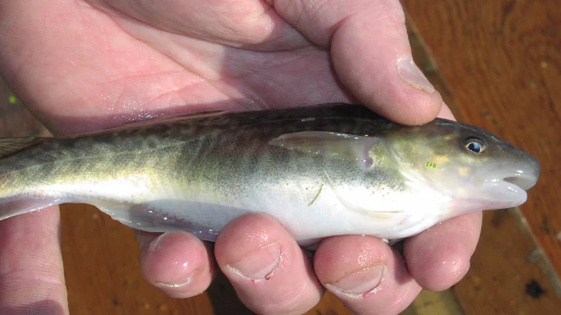

- [[Album empreintes DIGITALes 2022]]
- Idées concepts #climatechange #adaptation
	- Thym
		- Varieties of Mediterranean thyme (Thymus vulgaris) produce oils with different chemical compositions, and the ones with __stronger smelling compounds like phenols are more effective at deterring herbivores.__ Producing phenols typically comes at a cost, though, as **_these plants are more sensitive to freezing_**. But in southern France’s Saint-Martin-de-Londres basin, winters are getting warmer.
		  Looking at 24 populations across the basin in 1974 versus 2010, one study found an increase in the proportion of plants that produce phenolic compounds.
		  https://www.smithsonianmag.com/science-nature/ten-species-are-evolving-due-changing-climate-180953133/
		- 
		- Puerto Rican crested anole lizard (Anole)
		- In the forest, this particular species of anole lizard runs on branches and catches insects, but in the city it mostly hangs around on human structures, on walls and windows, on large and often much smoother surfaces than in the forest. And these lizards need to grip onto their substrate quite tightly. They’re heavy enough to break bones when they fall from a great height. So they have toe pads, just like geckos do, with lamellae that help them to grip on the surfaces.
		  And we see that in the cities, **_the legs have become longer and they have obtained more of these lamellae under their feet._** And the idea is that the surfaces in the city are smoother so they need a better grip. Also, because the surfaces are usually much larger and flatter than the branches in the forest, the lizards need longer appendages to move faster and to hold on better. There are very nice videos where you can see that these forest lizards, when you put them on a tiled, slippery urban slope, that they really have trouble walking up properly, whereas a city lizard runs up like it’s no problem at all.
		  https://e360.yale.edu/features/urban-darwinism-how-species-are-evolving-to-survive-in-cities
		  + https://en.wikipedia.org/wiki/Anolis_cristatellus
		- 
		- Peppered moth
		- The evolution of the peppered moth over the last two hundred years has been studied in detail. At the start of this period, the vast majority of peppered moths had light coloured wing patterns which effectively camouflaged them against the light-coloured trees and lichens upon which they rested. However, due to widespread pollution during the Industrial Revolution in England, many of the lichens died out, and the trees which peppered moths rested on became blackened by soot, causing most of the light-coloured moths, or typica, to die off due to predation.
		  **_This has led to the coining of the term "industrial melanism" to refer to the genetic darkening of species in response to pollutants._**
		  https://en.wikipedia.org/wiki/Peppered_moth_evolution
		- 
		- 
		- London Underground mosquito
		- Whilst it was being constructed in the 19th Century, **_mosquitoes followed workmen down into the tunnels of the London Underground._** The insects persisted by feasting on the blood of rodents, and of the poor Londoners who took shelter on the platforms during the Blitz.
		  https://www.sciencefocus.com/nature/10-weird-ways-humans-have-influenced-animal-evolution/
		- 
		- New York Park Mice
		- The populations have evolved in different directions and now all their mice have their own park-specific DNA. Mice in Manhattan have a genetic signature that is different from mice from Queens and the Rockaway Peninsula. Not just that, there are signs that the mice are adapting to their city locations.
		  
		  **_White-footed mice from Central Park, for example, carry versions of genes that help them to process fatty foods and neutralise the toxins that are sometimes found in mouldy nuts._** In the 120 years or so they have been isolated in the famous park, it seems as though they have been evolving to eat New York staples such as pizza and peanuts!
		  https://www.sciencefocus.com/nature/10-weird-ways-humans-have-influenced-animal-evolution
		- 
		- Scottish red deer
		- This deer is slightly smaller than other Western European red deer, an example of insular dwarfism.
		  **_Insular dwarfism, a form of phyletic dwarfism, is the process and condition of large animals evolving or having a reduced body size when their population's range is limited to a small environment, primarily islands._**
		  https://en.wikipedia.org/wiki/Scottish_red_deer#Population
		- 
		- *__Warm-blooded animals, such as birds and mammals, are getting larger legs, tails and beaks that improve the way they regulate body temperature.__*
		  https://www.discovery.com/nature/shape-shifting-is-how-some-animals-adapt-to-climate-change
			- Scientists examined the size of appendages from a number of species over time and found that birds like the North American dark-eyed junco, a songbird, and several species of Australian parrots show increases in bill (bec) size.
			- Studies of mammals reveal size increases across lots of different species. Wood mice with longer tails and masked shrews with larger legs are part of a wider geographical trend.
			- Size increases like this are predicted in Allen’s Rule, put forward by American zoologist Joel Asaph Allen in 1877, suggesting *__animals adapted to warmer climates have larger limbs and appendages than those in colder regions. __* #climatechange #adaptation
			  https://en.wikipedia.org/wiki/Allen%27s_rule
			- 
		- "Walking trees" (not necessarily caused by human, but still interesting)
		  https://en.wikipedia.org/wiki/Socratea_exorrhiza
		- Socratea exorrhiza, the walking palm or cashapona. John H. Bodley suggested in 1980 that stilt roots in fact __allow the palm to "walk" away from the point of germination__ if another tree falls on the seedling and knocks it over.
		- 
		- "As interesting as it would be to think that when no one is around trees walk the rainforest floor, it is a mere myth"
		- Like the Ents from JRR Tolkien’s epic Lord of the Rings saga (only a bit slower), these trees actually move across the forest as the growth of new roots gradually relocates them, sometimes two or three centimetres per day. While some scientists debate whether these trees walk, Peter Vrsansky, a palaeobiologist from the Earth Science Institute of the Slovak Academy of Sciences Bratisla, claims to have seen this phenomenon first hand.
		  
		  “As the soil erodes, the tree grows new, long roots that find new and more solid ground, sometimes up to 20m,” said Vrsansky. “Then, slowly, as the roots settle in the new soil and the tree bends patiently toward the new roots, the old roots slowly lift into the air. The whole process for the tree to relocate to a new place with better sunlight and more solid ground can take a couple of years.”
		  https://www.bbc.com/travel/article/20151207-ecuadors-mysterious-walking-trees
		- Himalayan snow lotus, Saussurea laniceps (Asteraceae)
		- In our case, we observed that human harvesting of larger individuals of a rare plant for medicinal purposes __resulted in the rapid evolution of smaller individuals__ over only 100 years.
		  https://www.pnas.org/doi/10.1073/pnas.0502931102
		- Paradoxically, with unconscious human selection, when a species posses a certain trait that is valued by people (e.g., large size), individuals with that trait will be preferentially harvested, and this selection will leave individuals that possess less desirable traits (e.g., small plants). Evidence for this process has been reported from fisheries that harvest larger fish, resulting in smaller fish and lower yields.
		- 
		- Atlantic tomcod (poisson des chenaux) -> __Scientists have discovered a strange fish that lives in a soup of some of industry's worst pollutants.__ The fish, found in rivers in New York and New Jersey, survive because they've evolved to cope with dangerous chemicals.
		  But some tomcod — just by chance — had a version of that gene that tolerates PCBs and dioxin. So over time, fish with the resistant gene did better than fish without it, and pretty much took over.
		  -> They're prey for bigger fish, which absorb the pollutants in the tomcods and pass them up to whatever, or whoever, eats them
		  https://www.npr.org/2011/02/17/133842089/toxic-avengers-pollution-drove-fish-evolution
		- After General Electric dumped polychlorinated biphenyls (PCBs) in the Hudson River from 1947 through 1976, tomcod living in the river were found to have developed an increased resistance to the compound's toxic effects. Scientists identified the genetic mutation that conferred the resistance, and found that the mutated form was present in 99 percent of the tomcods in the river, compared to fewer than 10 percent of the tomcods from other waters.
		  https://en.wikipedia.org/wiki/Microgadus_tomcod
		- 