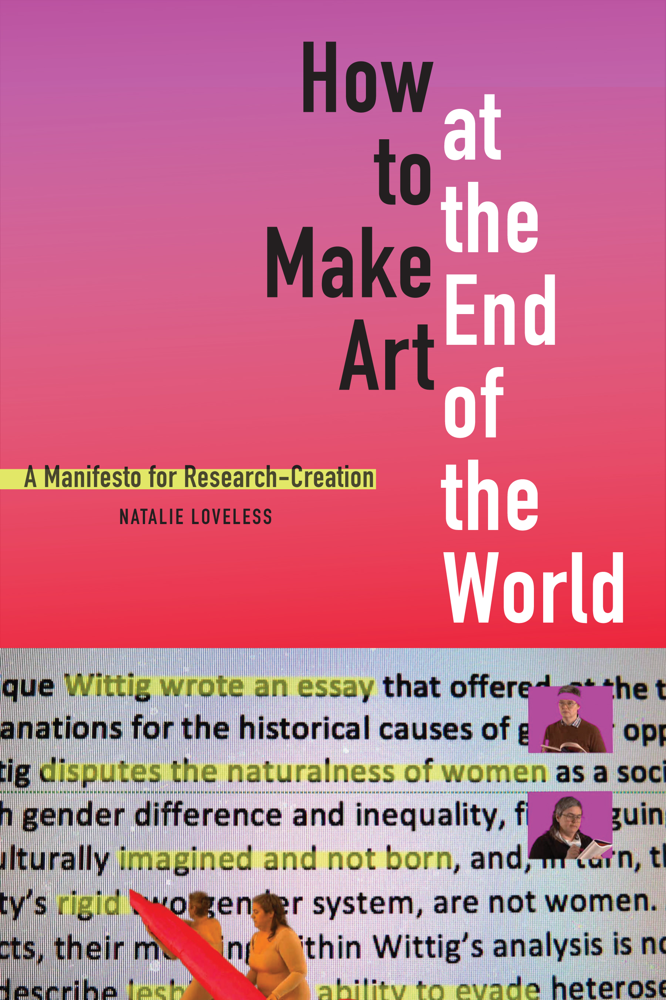

- How to Make Art at the End of the World: A Manifesto for Research-Creation
- {:height 462, :width 296}
- Loveless, N. (2019). *How to Make Art at the End of the World: A Manifesto for Research-Creation*. Duke University Press.
- 01_ Haraway's Dog
	- "Entrenched stories like 'race,' 'gender,' 'class,' and 'nation' have historically done this very well, prescribing who might accomplish what, where, when, and how." (pp. 20) #hierarchies
	- "The work of telling new stories, or new versions of stories that need retelling/recrafting, is propositional; it requires ongoing engagement and a willingness to denaturalize the social, disciplinary, ideological structures within which we are embedded [...]" (pp. 20) #stories
	- "[...] to remind us that the telling of stories is a political performative." (pp. 21) #stories
	- "[...]  which stories are animating our choices? [...] world-changing fictions [...]." (pp. 24) #stories
	- "[...] the crafting of a research question is the crafting of a story that is also the crafting of an ethics." (pp. 24) #ethics
	  background-color:: green
	- "Haraway’s book (as does King’s, in a different idiom) implicitly argues that it is in allowing ourselves to be drawn by our loves, our intensive and extensive curiosities, attentive to what and whom we are driven to explore, and examining the complex web of relations that we inherit thereby, that we might inhabit research questions ethically." (pp. 27) #love
	- "Haraway loves Roland and Cay- enne. It is that love, and her need to take what she inherits with that love seriously, that guides her research in Companion Species. True love (eros) leads, as Haraway models for us, to true curiosity—to truly driven curiosity." (pp. 27) #love
	- "In this respect, research-creation is taught by the ways that feminism has dealt with the denigration of certain forms of work (maintenance and care work) and certain vocalities (the “personal voice”). It is taught this not only by feminism, but by Indigenous, decolonial, and antiracist scholarship challenging institutional structures and intellectual traditions that draw their power from seeing certain kinds of research as nonresearch" (pp. 29)
	- "[...] to think carefully about which stories we are telling, why, and how, in the university today.20
	  The how, here, is crucial. [...] different species of output [...]are understood to have equally weighted value as objects of knowledge production and impact within university communities and their assessment rubrics." (pp. 30)
	- I still struggle with the 'equally weighted'
	  background-color:: red
	- "[...] while each work succeeds in interweaving 'practice' and 'theory,' one side of the binary is understood as support/developmental or conceptual material for the other. An “exemplary” research-creation practice resists this hierarchy in the context of the academy [...]" (pp. 31)
	- "Interdisciplinary study consists of creating a new object, which belongs to no one." (pp. 31)
	- "[...] outputs that are academic, outputs that are artistic, and outputs that are activist, and each of these sets of research outputs are (designed to be) weighted equally [...] It promiscuously inhabits all of these spaces, speaking to each, resisting being fully claimed by any one disciplinary location [...]" (pp. 33)