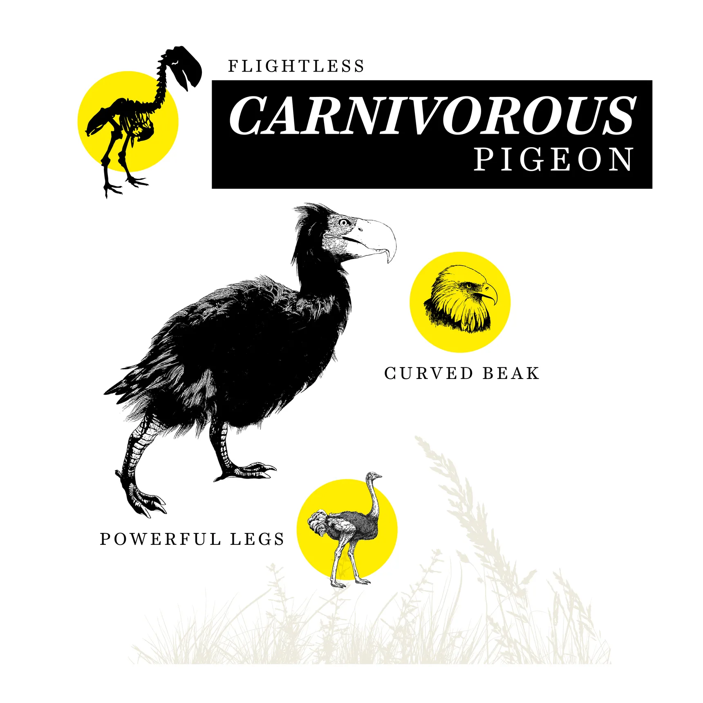
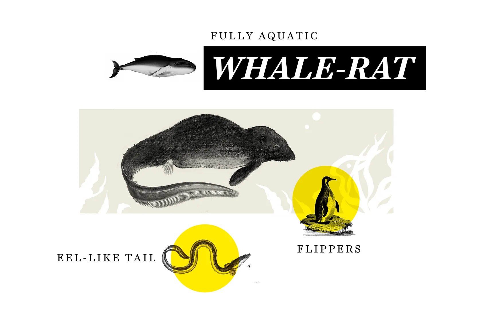
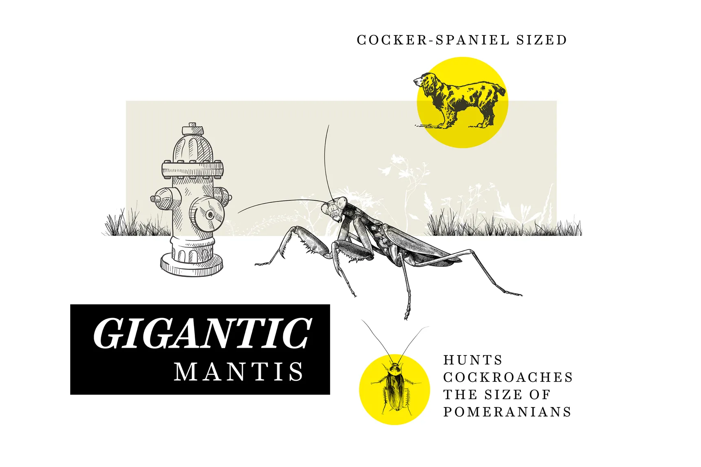
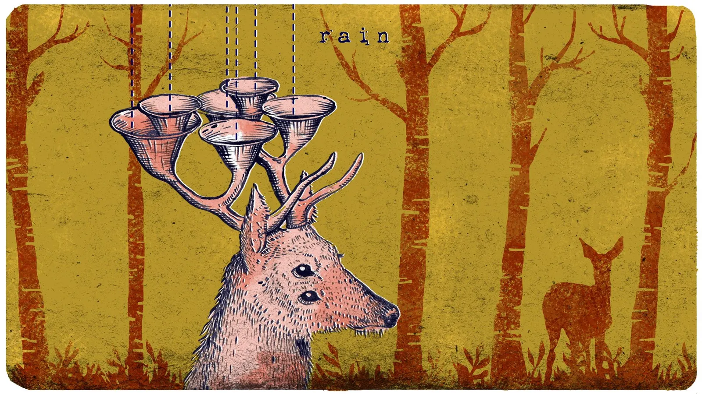

- [[Album empreintes DIGITALes 2022]]
- [[Espèces animales et fauniques forcées d'évoluer pour survivre à la crise climatique]]
- The animals that may exist in a million years, imagined by biologists #speculativeevolution #adaptation
  https://www.vox.com/down-to-earth/22734772/future-animals-evolution-unexplainable
- 
- If these species survive the ecological changes that are occurring now, they might also evolve to fill ecological space left behind by extinct animals. For instance, if tigers go extinct in the next million years, perhaps flightless, carnivorous pigeons and rats will grow to the size of ostriches and snack on the animals that tigers once ate. It’s impossible to predict which specific adaptations might emerge in which animals, but it’s clear that as some species die off, **_they leave a gap in the food chain that can be filled by other species._** #biodiversityloss
- 
- And if life on land grows too harsh, *__rats may be able to slowly adapt to water.__* Perhaps their evolutionary descendants will lose their fur or sprout flippers, developing streamlined bodies suited for a fully aquatic existence. Other marine mammals, like seals and whales, have followed this path in their transition from land-dwelling creatures to aquatic ones.
- --> Environment of the future
- Plastic is “a big source of carbon, which all living things depend on,” said Sahas Barve, an evolutionary ecologist at the Smithsonian National Museum of Natural History. Plastic, he added, could become food, and “any animal that can exploit that will be successful.”
  Termites could be one such critter. These insects already have a gut microbiome — a collection of microorganisms that help with digestion — that breaks down cellulose. Like plastic, cellulose is made of a complex carbon polymer, so it’s not a stretch to imagine termites adapting to break down another polymer like plastic.
  
  “I could easily imagine them evolving a microbiome that helps them then digest plastic,” Barve says. Some fungi and bacteria, including some found in the stomachs of cows, are already able to break down plastic.
- The distant future is also likely to be more watery, as sea-level rise decreases the portion of the planet covered by dry land. In envisioning a world of rising seas and altered coastlines, some scientists think about how certain animals might take to living in more marine environments.
  
  Sharlene Santana, a professor of biology at the University of Washington, *__considers how a bat species might evolve to live off of, and around, the oceans. She imagines a bat with a six-foot wingspan taking shape, capable of gliding like an albatross instead of flapping its wings, perhaps covering hundreds of miles in search of food or islands to roost.__* It might use finely-tuned echolocation to sense ripples in the water in order to detect fish. (In fact, some bats already do this.)
- If humans were to go extinct, our carbon emissions could still remain in the air for a long time, Alter, the Cal State professor of evolutionary biology, said. *__That could lead to boom times for plants, some of which can thrive in a CO2-dense atmosphere.__*
  
  The increased density and diversity of plants, in turn, might eventually increase the concentration of oxygen in the atmosphere. Researchers have hypothesized that the growth of insects depends in part on the concentration of oxygen in the atmosphere, *__which could lead to insects developing larger bodies__*, Alter says. So a future, oxygen-rich world is one that might be able to foster rabbit-sized praying mantises, or “ants as large as hummingbirds and dragonflies as large as hawks,” Alter said.
- 
- As species continue to go extinct, whether due to habitat loss, agriculture, poaching, or human-caused climate change, many potential sources of diverse life are extinguished from the future, too.
- Scientists can still imagine a world where animals that are endangered today carry on and start new branches on the evolutionary tree. The future doesn’t have to belong to just the rats, pigeons, and insects. As long as manatees, polar bears, and monarch butterflies are around, for example, there remains the possibility of their descendants entering the picture sometime in the future.
- Strange evolution: The weird future of life on Earth
  https://www.bbc.com/future/article/20190715-strange-evolution-the-weird-future-of-life-on-earth
- In a hotter world, Brennan also envisages the rise of naked mammals and birds: *__“Mammals may lose fur in some patches and collect water in skin pockets.__* In a warming planet, endothermic animals [those that generate their own heat] may have a hard time, so birds in warmer climates may lose contour feathers to prevent overheating, and mammals may lose most fur.”
- 
- Extinction in particular can lead to sweeping evolutionary innovation. *__In essence, a mass extinction resets the evolutionary clock, argues Ward.__* After previous mass extinctions, he says, Earth’s plants and animals changed radically. #massextinction
- So, if humans die off, how wild and sophisticated could things get 100 million years from now? Could we see trees starting to walk, or feasting on animals after killing them with toxic fumes or poisonous darts? Could sea life change, with spiders taking to the water, using their webs to net sardines, while fish learn to fly so they can feed on insects and birds? *__Could deep-sea animals project bright holograms of themselves to fool predators, attract prey or impress potential mates?__* Perhaps killer whales and catfish will regain their ancestors’ past ability to run on land so that they can hunt more effectively onshore?
- --> In nature, often all it takes for unusual adaptations to develop are *__extreme environments.__*
- This potential for habitat-switching leads to some pretty fantastical possibilities. Consider a toad whose gullet swells outward as a large gasbag used to make mating calls. In his book, Ward playfully envisages it evolving into a “zeppelinoid”, a new type of floating animal that will conquer the lower atmosphere. *__The toad could evolve to make hydrogen out of water and store it in its throat, helping it to hop and eventually float in the air.__* Its legs – no longer needed for walking – could become dangling tentacles used for feeding and it would evolve to be large to avoid being eaten – maybe even larger than a blue whale. Giant zeppelinoids would float in the air like jellyfish, dragging their tentacles to catch prey such as deer, and grazing on treetops. They would fill the skies and their shifting shadows would dominate the landscape – the age of the flying toad.