title:: Project_A-2022_ResearchDevelopment
public:: true

- [[Projet A-2022]]
-
- __MENU__
	- ((633c950d-522a-4489-818a-f3882e238954))
	- ((6331b4d4-2e5d-41f7-8d6f-7fb99d8991d1))
	- ((63279ac0-02db-4d56-a253-cd4163216a23))
		- ((6331b512-4142-4f2c-bc79-64c722c4010e))
		- ((6328f5bb-6848-4c88-928e-d8f6105cbbe3))
		- ((63375819-7323-44ef-a2fe-899566643fd7))
		- ((633c9637-3898-4235-854d-f0193a57ae2a))
	- ((6328dde4-426a-47b1-bdfa-07225f4e1298))
	- ((6328f60e-a2d7-47d6-96c1-da7ab963e387))
-
- LITTERATURE + CONCEPTUAL APPROACH
  background-color:: #533e7d
  id:: 633c950d-522a-4489-818a-f3882e238954
	- René Descartes -> concept of animal-machine
		- https://aeon.co/essays/can-animals-be-usefully-described-as-clockwork-machines
	- Underbug: An Obsessive Tale of Termites and Technology
		- Swarm behavior
	- Immersive environment -> earth smell?
- GENERAL TECHNICAL INFOS
  background-color:: #793e3e
  id:: 6331b4d4-2e5d-41f7-8d6f-7fb99d8991d1
	- How to publish logseq docs to internet (trough github)
		- 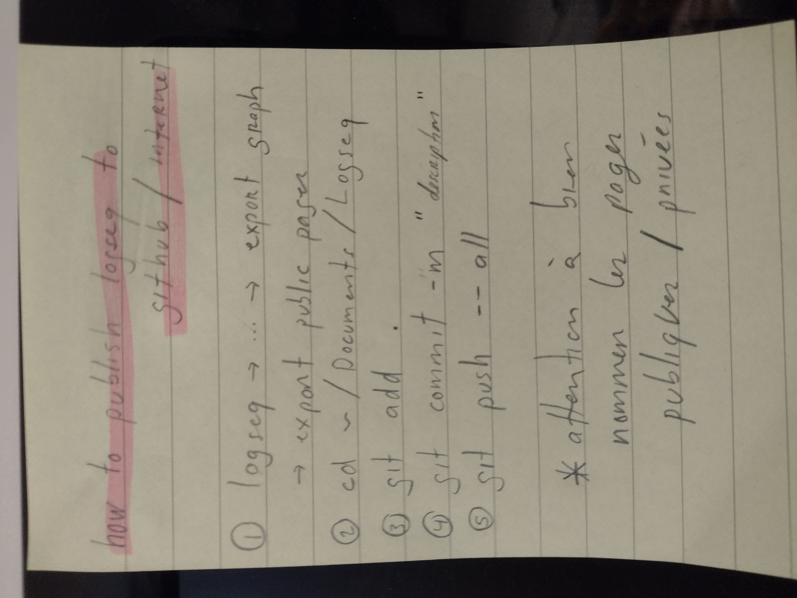{:height 556, :width 417}
		-
	- __IC 555__
	  collapsed:: true
		- 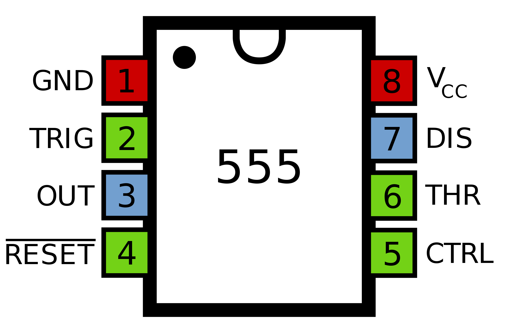
	- __Circuits how-to videos__
	  collapsed:: true
		- LED fader with 555: https://www.youtube.com/watch?v=XajEBM7iC4A&ab_channel=learnelectronics
		- Adjustable strobe with 555: https://www.youtube.com/watch?v=H1jpMqPHyjA&ab_channel=learnelectronics
		- Light/Dark detector: https://www.youtube.com/watch?v=3G9f7u60D4w&ab_channel=learnelectronics
		-
	- Serie vs parallel
	  collapsed:: true
		- (connecter batteries en séir pour doubler voltage, en parallèle pour doubler l'ampérage) ~~
		- 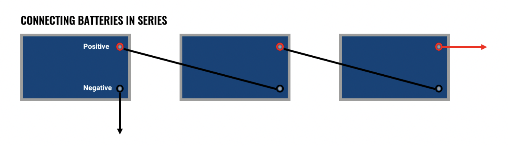
		-
		- Motors in serie/parallel
		- 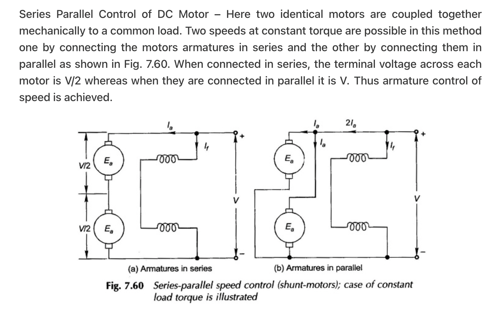
		-
- TESTED AND WORKING CIRCUITS
  background-color:: #497d46
  id:: 63279ac0-02db-4d56-a253-cd4163216a23
	- __2022/08/28__
	  id:: 6331b512-4142-4f2c-bc79-64c722c4010e
		- Hysteretic oscillator + fade (555)
		  -> Alternating flashing lights (fade)
		- 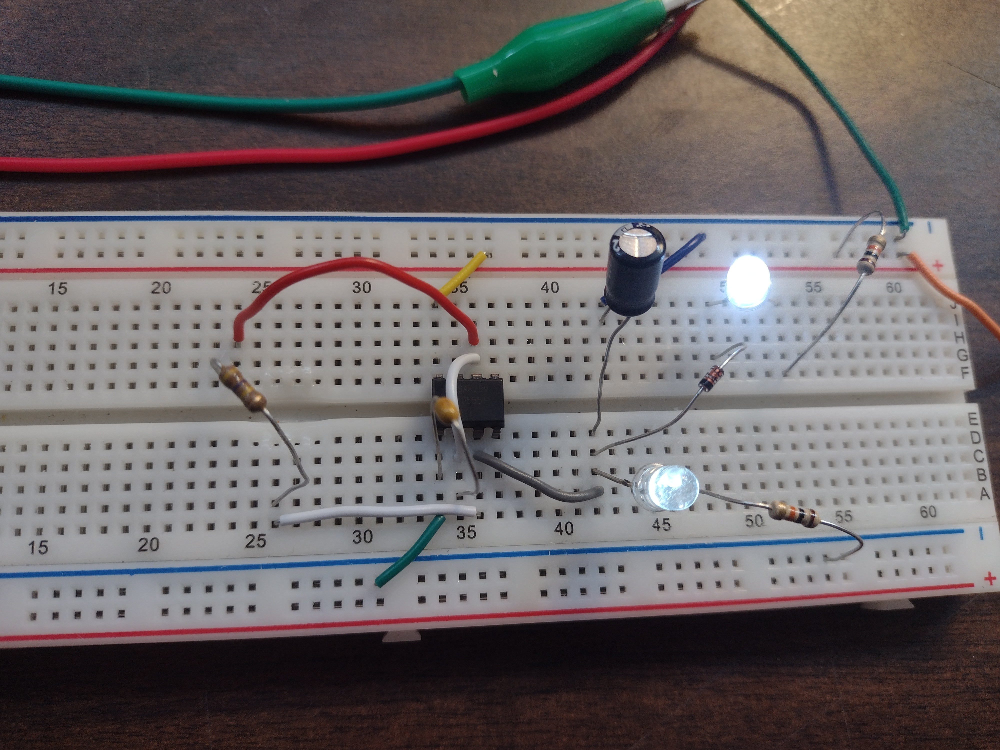
		-
		- Dark detector (avec 2N3904) https://www.youtube.com/watch?v=3G9f7u60D4w&ab_channel=learnelectronics
		  -> Light turns on when it's dark
		  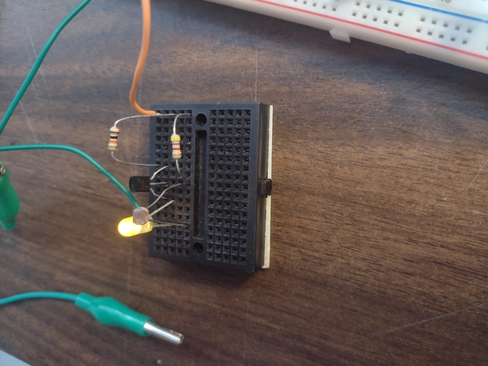
		-
		- Simple blinking LED circuit https://www.instructables.com/Simple-Blinking-LED-Circuit/
		  -> Alternating flashing lights
		  -> Some resistors can be replace by LDR to have variations
		  
		  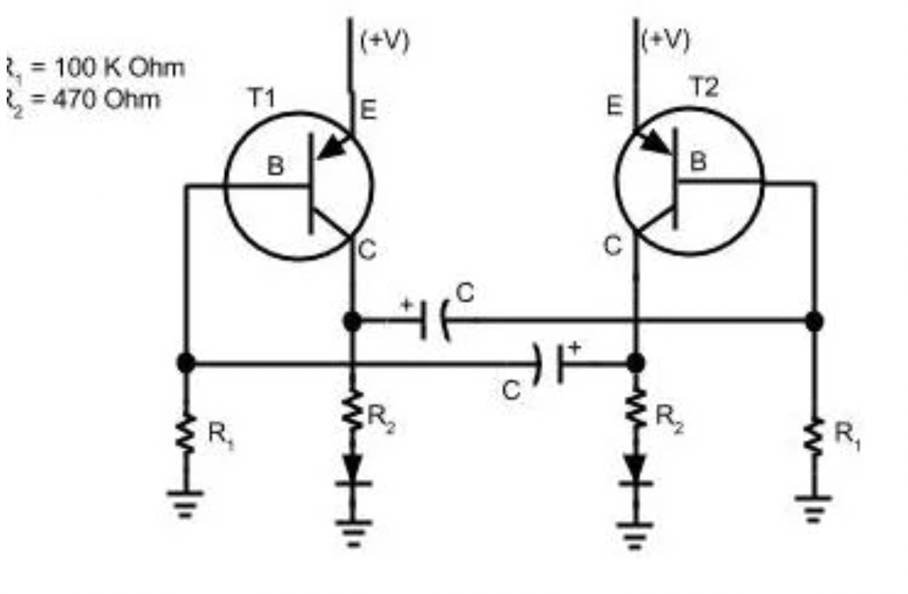 
		  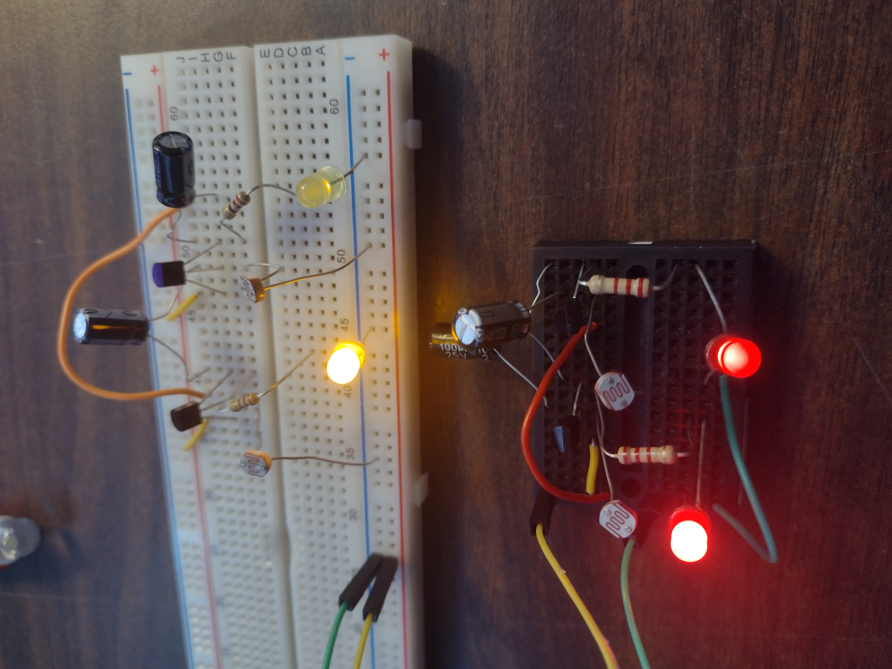
		- {{video https://www.youtube.com/watch?v=tyP070O907o&list=PLQMybz_OeLzKiRKXyQD9YUUsHyoGO-XxA&index=5&ab_channel=L%C3%A9aBoudreau}}
		-
		- "Bird sound" Generator
		  -> High pitched repetitive "bird-like" sounds
		  -> Pour modifier la vitesse = changer R1 et/ou C2
		  -> Pour baisser le volume = changer C4 (1uF ou 0.1uF)
		  -> Pour modifier le durée de chaque impulsion = changer R2
		  -> Bon mix de LDR = 8-16kohm + 10-50kohm
		  
		  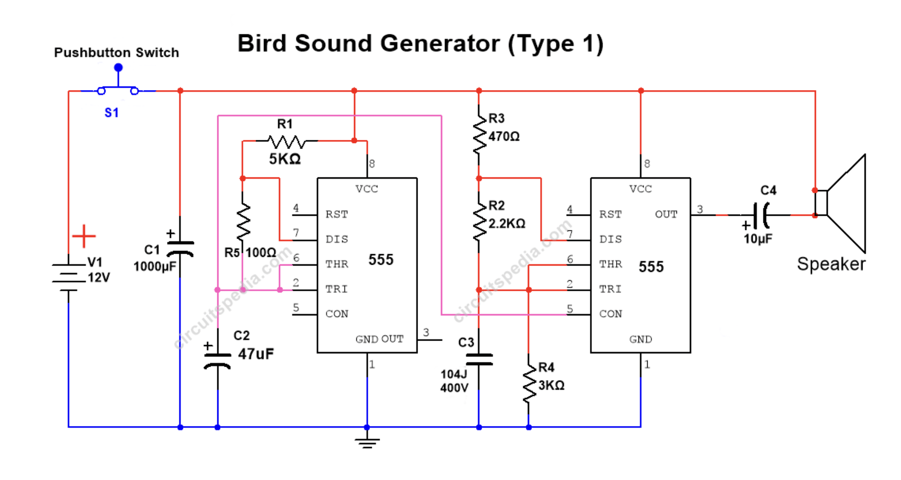 
		  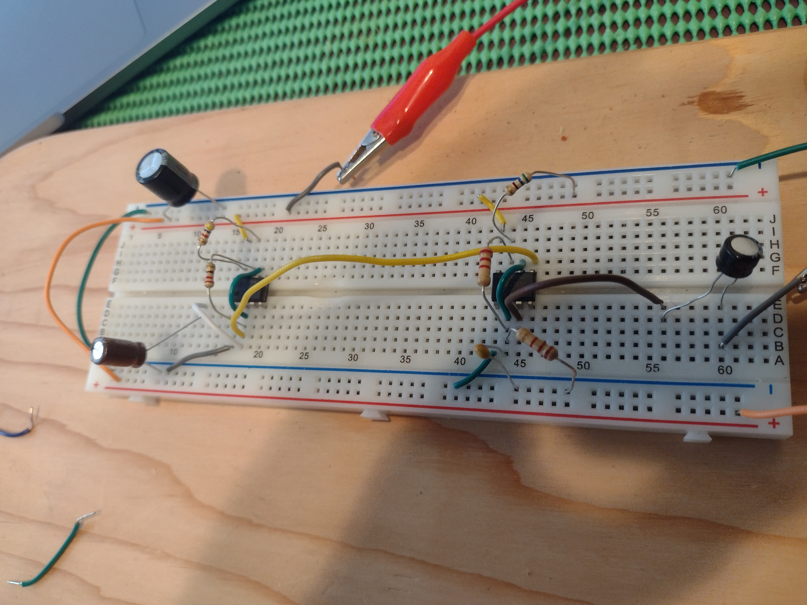
		- {{video https://www.youtube.com/watch?v=5dWZEgC4IEg&list=PLQMybz_OeLzKiRKXyQD9YUUsHyoGO-XxA&index=4&ab_channel=L%C3%A9aBoudreau}}
		- {{video https://www.youtube.com/watch?v=r1Twf_5HLsE&list=PLQMybz_OeLzKiRKXyQD9YUUsHyoGO-XxA&index=3&ab_channel=L%C3%A9aBoudreau}}
	- __2022/09/19__
	  id:: 6328f5bb-6848-4c88-928e-d8f6105cbbe3
		- Uneven clicks - 555
		  -> Tictic-tic
		  -> Resistor and/or diode can be replaced by LDR
		  
		  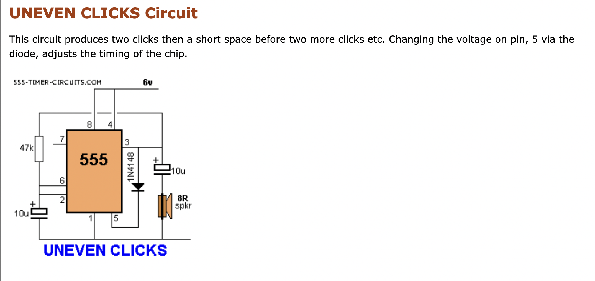
		-
		- Clap switch with microphone
		  -> LED turns on when sound is detected
		  -> Sound needs to be pretty loud to trigger the LED
		  -> Pour que la LED soit plus bright, choisir un resistor plus petit à mettre juste avant la LED
		  
		  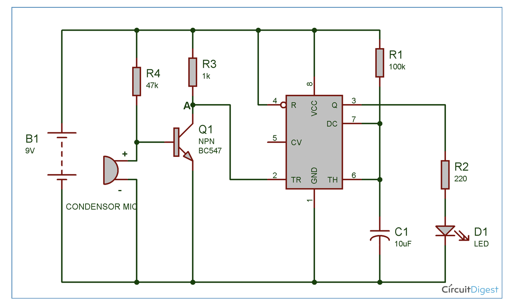 
		  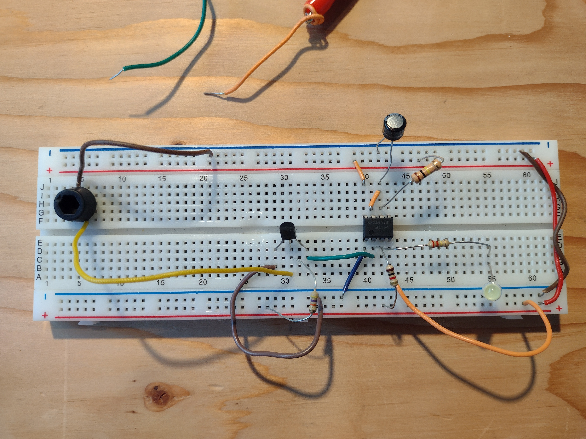
		-
	- __2022/09/30__
	  id:: 63375819-7323-44ef-a2fe-899566643fd7
		- Sound sensing circuit (sent by Koby Ratliff)
		  -> Motor is triggered when sound is detected
		  -> Really more sensitive than the previous circuit (works very well)
		  -> with 3.7V cell batterie or power supply
		  
		  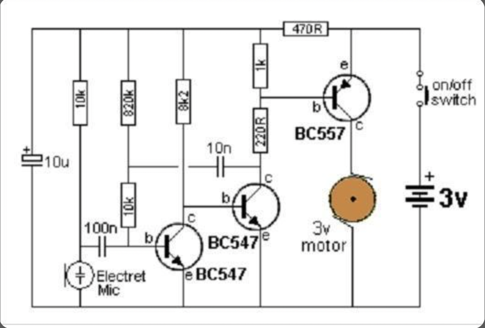
		  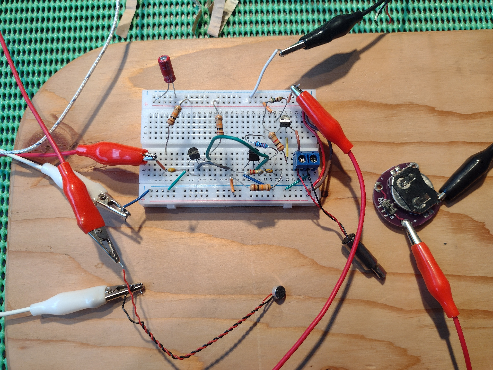
		- {{video https://www.youtube.com/watch?v=gTDme2iqAK0&list=PLQMybz_OeLzKiRKXyQD9YUUsHyoGO-XxA&index=6&ab_channel=L%C3%A9aBoudreau}}
	- __2022/10/15__
	  id:: 633c9637-3898-4235-854d-f0193a57ae2a
		- First building of the circuit with a 'robot' form [Sound sensing circuit from 2022/09/30]
		  -> ATTENTION = when vibration motor on the structure, it make noise/vibration that triggers the mic endlessly = it never stops moving
		  -> Either find a way to have the motor noise/vibration out of the range of the mic OR __choose another output behaviour (p. ex. light)__
		  -> TESTED* the circuit is ok because it behaves normally with a LED
		  
		  {{video https://www.youtube.com/watch?v=srFOP4KKxLU&list=PLQMybz_OeLzKiRKXyQD9YUUsHyoGO-XxA&index=1&ab_channel=L%C3%A9aBoudreau}}
		  {{video https://www.youtube.com/watch?v=Ay_uoPzJAbE&list=PLQMybz_OeLzKiRKXyQD9YUUsHyoGO-XxA&index=2&ab_channel=L%C3%A9aBoudreau}}
	- 2022/10/21
		- Building of a proto-robot with the 'bird sound' generator circuit
		- FAIL - will try again tomorrow with better methods
	- 2022/10/21
		-
- TO TRY LATER
  background-color:: #978626
  id:: 6328dde4-426a-47b1-bdfa-07225f4e1298
  collapsed:: true
	- BC547 equivalent is 2n3904 - Q1
	- BC557 equivalent is 2n3906 - Q2
	- 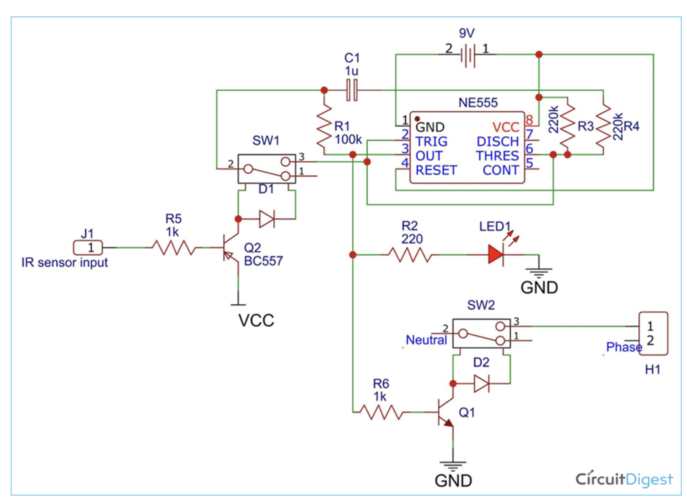
	- https://circuitdigest.com/electronic-circuits/simple-motion-detector-circuit-using-555-timer-and-relay-to-control-ac-loads
	-
	- Bird-like sound effect http://solarbotics.net/library/circuits/misc_sound_wilfbird.html
	- 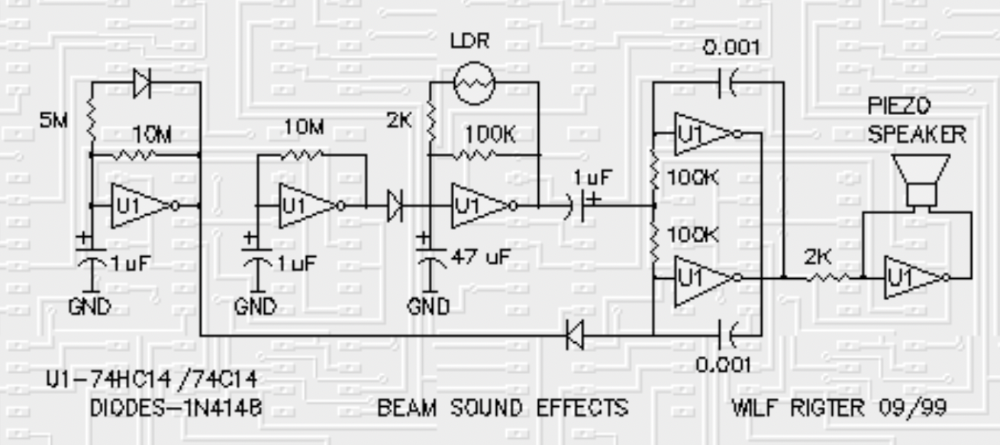
	-
	- Pummer (light)
	- 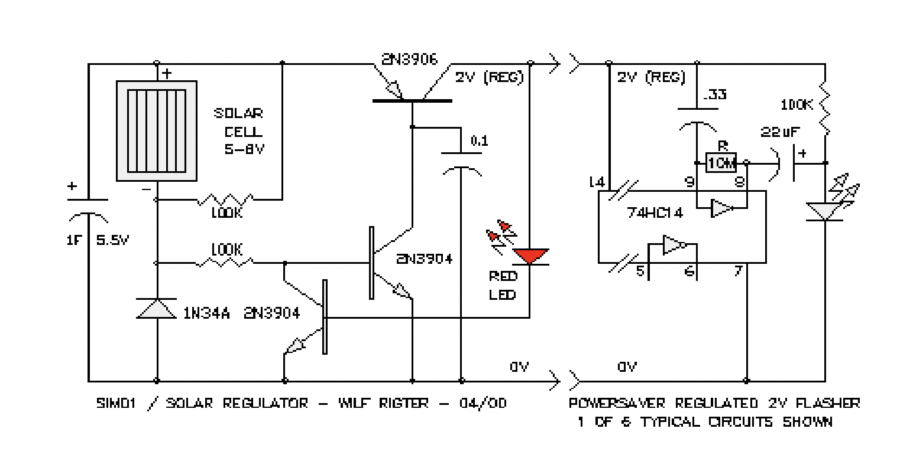
	-
	- Adjustable auto on/off delay time circuit (555) https://elonics.org/adjustable-auto-on-off-delay-timer-circuit-using-555/
	- 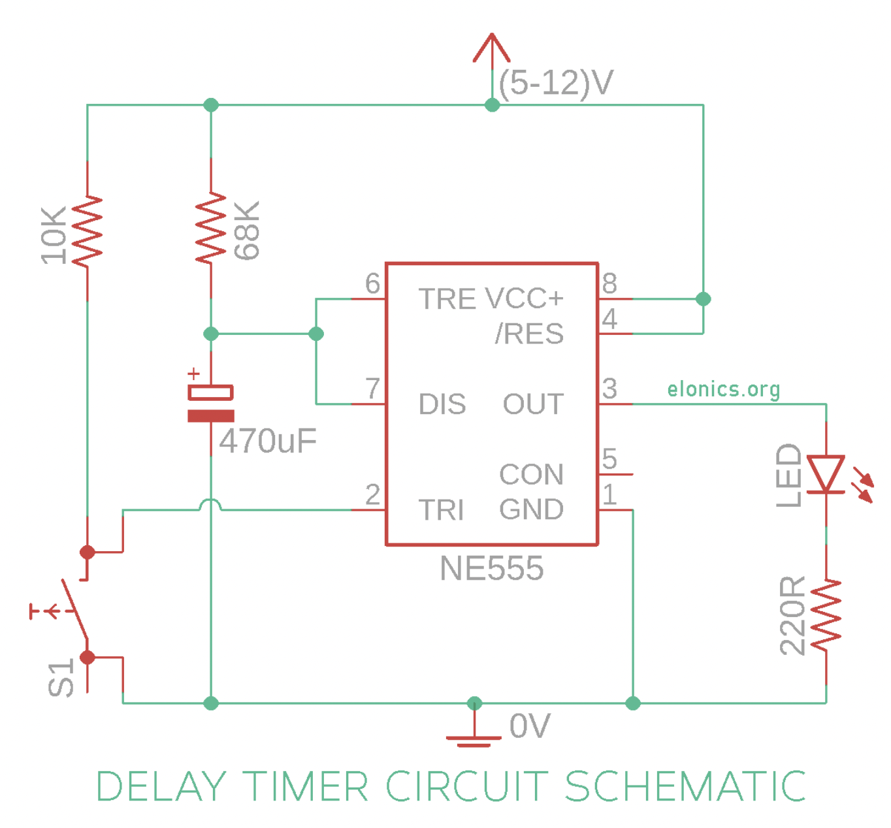
	-
- CIRCUITS THAT DIDN'T WORK
  background-color:: #264c9b
  id:: 6328f60e-a2d7-47d6-96c1-da7ab963e387
  collapsed:: true
	- Didn't work/unsatifying (2022/09/16)
	- 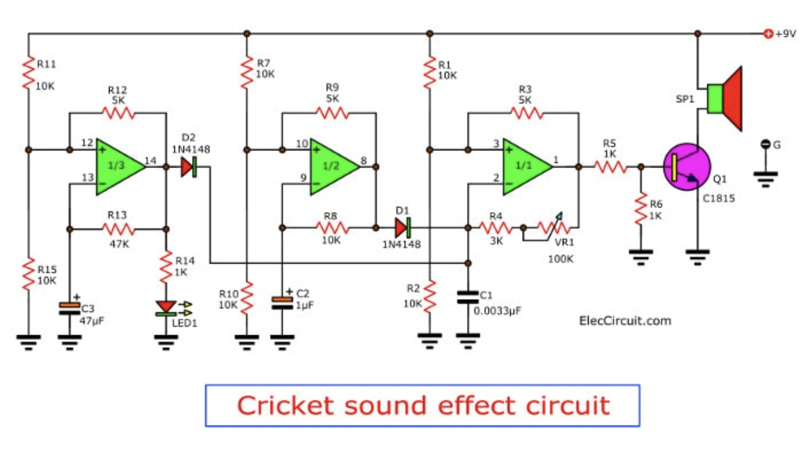
	- Didn't work/unsatifying (2022/09/19)
	  id:: 6328cb1b-d5fb-4ee3-b101-a9685c8be68d
	- 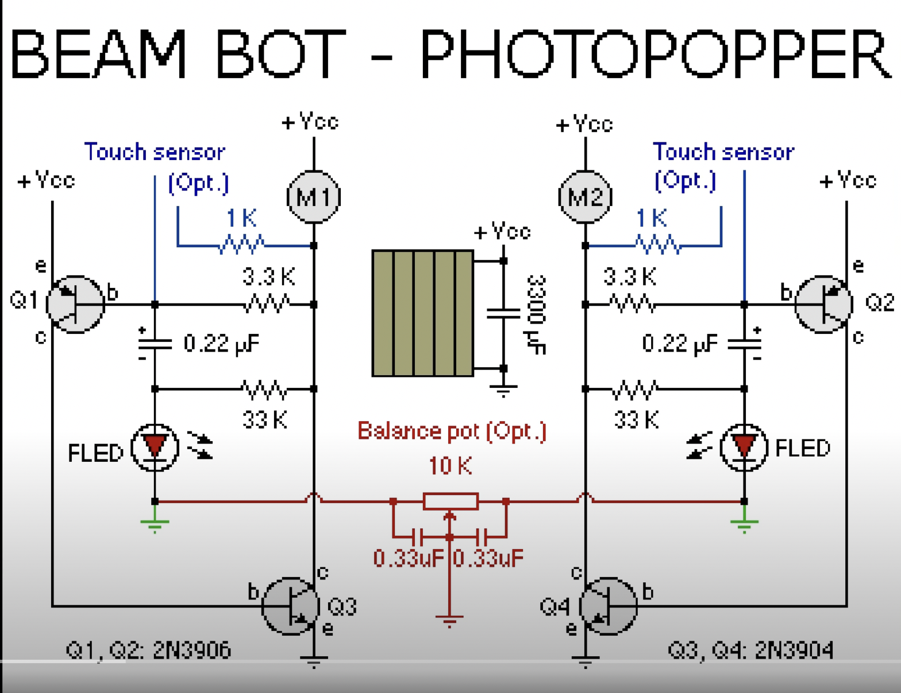
	- Scuff Circuit - Didn't work/unsatifying
	- 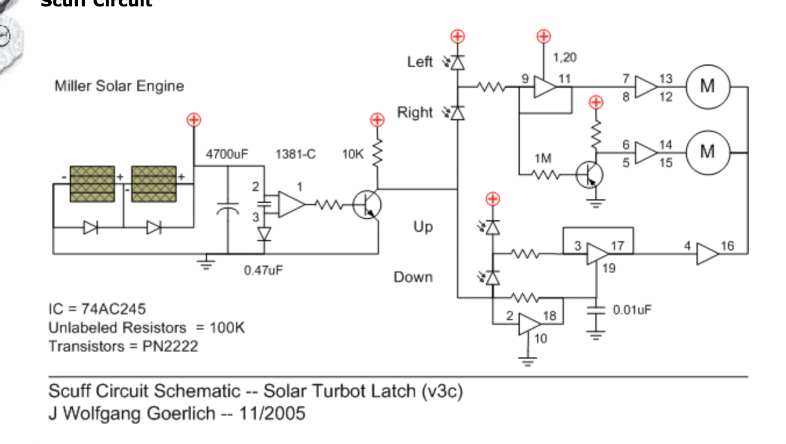