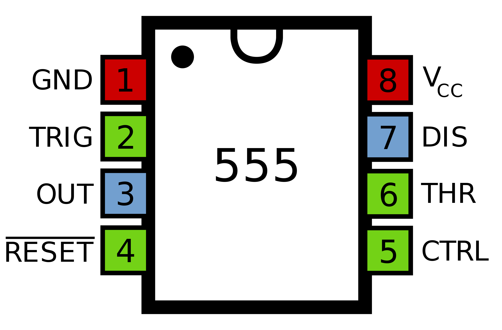
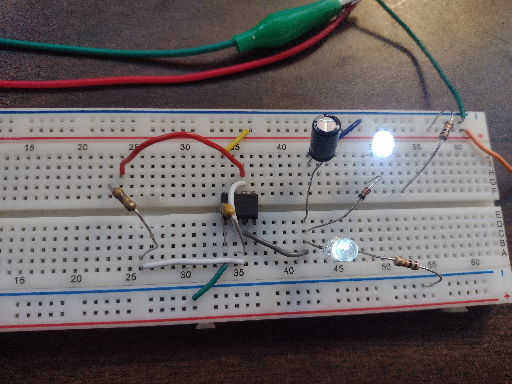
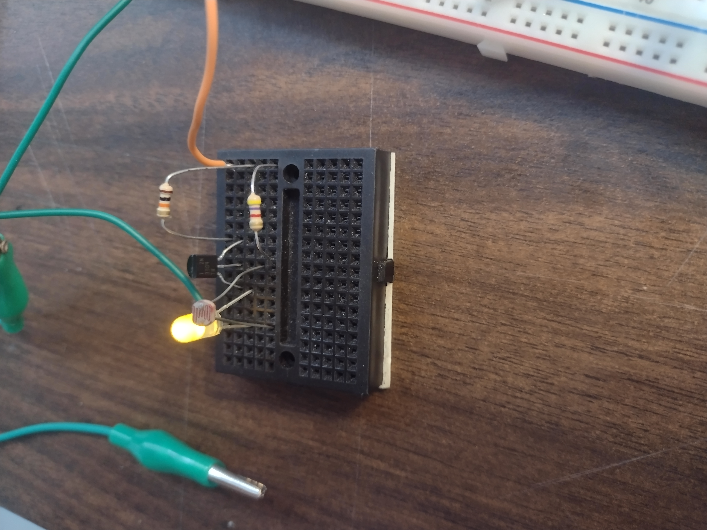
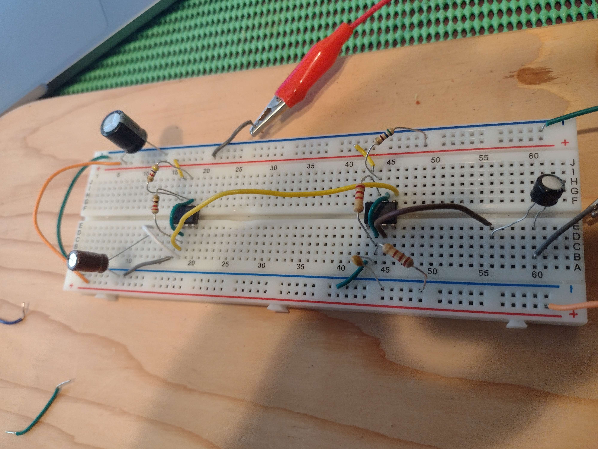
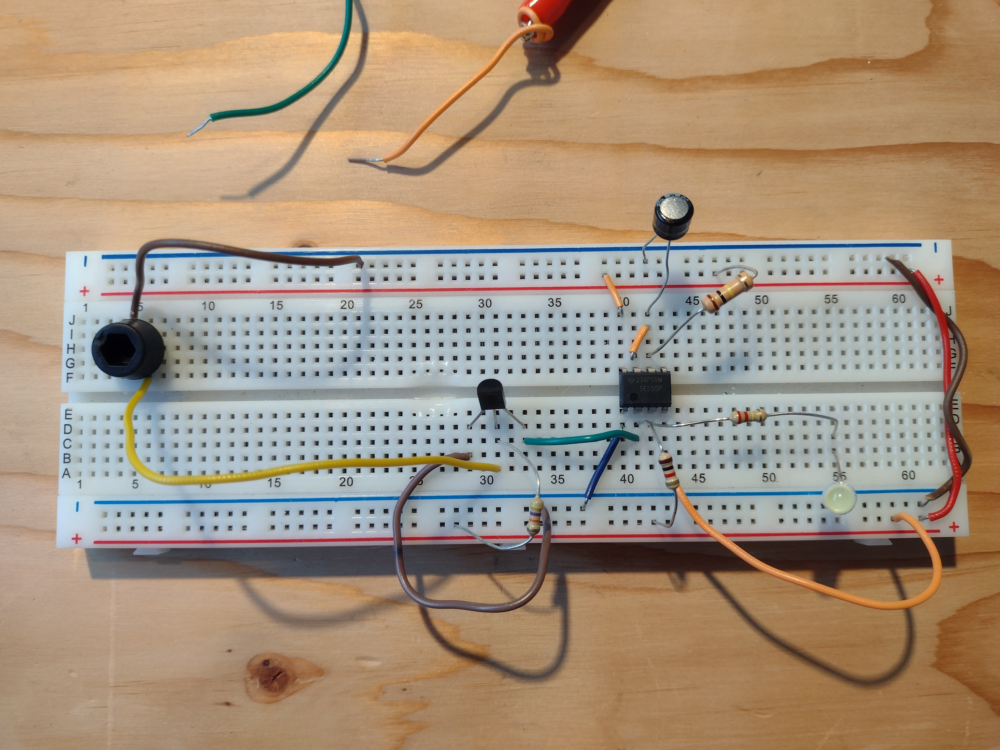
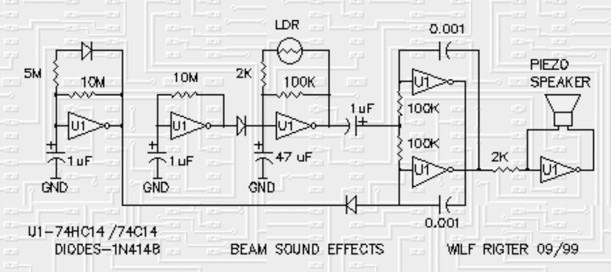

public:: true

- [[Projet A-2022]]
-
- __MENU__
	- ((6331b4d4-2e5d-41f7-8d6f-7fb99d8991d1))
	- ((63279ac0-02db-4d56-a253-cd4163216a23))
	- ((6328dde4-426a-47b1-bdfa-07225f4e1298))
	- ((6328f60e-a2d7-47d6-96c1-da7ab963e387))
-
-
- GENERAL TECHNICAL INFOS
  background-color:: #793e3e
  id:: 6331b4d4-2e5d-41f7-8d6f-7fb99d8991d1
	- __IC 555__
	- 
	- __Circuits how-to videos__
	- LED fader with 555: https://www.youtube.com/watch?v=XajEBM7iC4A&ab_channel=learnelectronics
	- Adjustable strobe with 555: https://www.youtube.com/watch?v=H1jpMqPHyjA&ab_channel=learnelectronics
	- Light/Dark detector: https://www.youtube.com/watch?v=3G9f7u60D4w&ab_channel=learnelectronics
	-
	- Connecter batteries en séries pour __doubler le voltage!__
	  background-color:: #533e7d
		- (en parallèle pour doubler l'ampérage)
		- 
-
-
- TESTED AND WORKING CIRCUITS
  background-color:: #497d46
  id:: 63279ac0-02db-4d56-a253-cd4163216a23
	- 2022/08/28
	- Hysteretic oscillator + fade (555)
	- 
	- Dark detector (avec 2N3904) https://www.youtube.com/watch?v=3G9f7u60D4w&ab_channel=learnelectronics
	- 
	- Try a mix of those 2 circuits (do not forget to unplug when making changes in the circuit)
	-
	- TO DO
		- Control blink speed (potentiometer) automatically and random
		-
	- Simple blinking LED circuit https://www.instructables.com/Simple-Blinking-LED-Circuit/
		- 
		- 
		-
	- {:height 406, :width 746}
	- Pour modifier la vitesse = changer R1 et/ou C2
	- Pour baisser le volume = changer C4 (1uF ou 0.1uF)
	- Pour modifier le durée de chaque impulsion = changer R2
	- Bon mix de LDR = 8-16kohm + 10-50kohm
	- 
	-
	- 2022/09/19
	- 
	- Resistor and/or diode can be replaced by LDR
	-
	- Clap switch with microphone
	- 
	- *More sensitive mic + more bright light
	- -> Pour que la LED soit plus bright, choisir un resistor plus petit à mettre juste avant la LED
	  background-color:: #978626
	- 
-
-
- TO TRY LATER
  background-color:: #978626
  id:: 6328dde4-426a-47b1-bdfa-07225f4e1298
	- 2022/09/21
	- BC547 equivalent is 2n3904 - Q1
	- BC557 equivalent is 2n3906 - Q2
	- 
	- https://circuitdigest.com/electronic-circuits/simple-motion-detector-circuit-using-555-timer-and-relay-to-control-ac-loads
	-
	- Bird-like sound effect http://solarbotics.net/library/circuits/misc_sound_wilfbird.html
	- 
	-
	- Pummer (light)
	- 
	-
	- Adjustable auto on/off delay time circuit (555) https://elonics.org/adjustable-auto-on-off-delay-timer-circuit-using-555/
	- 
-
-
- CIRCUITS THAT DIDN'T WORK
  background-color:: #264c9b
  id:: 6328f60e-a2d7-47d6-96c1-da7ab963e387
	- N'a pas fonctionné (2022/09/16)
	- 
	- 2022/09/19
	- N'a pas fonctionné
	- 
	- Scuff Circuit (pas sûre que je peux le faire)
	- 