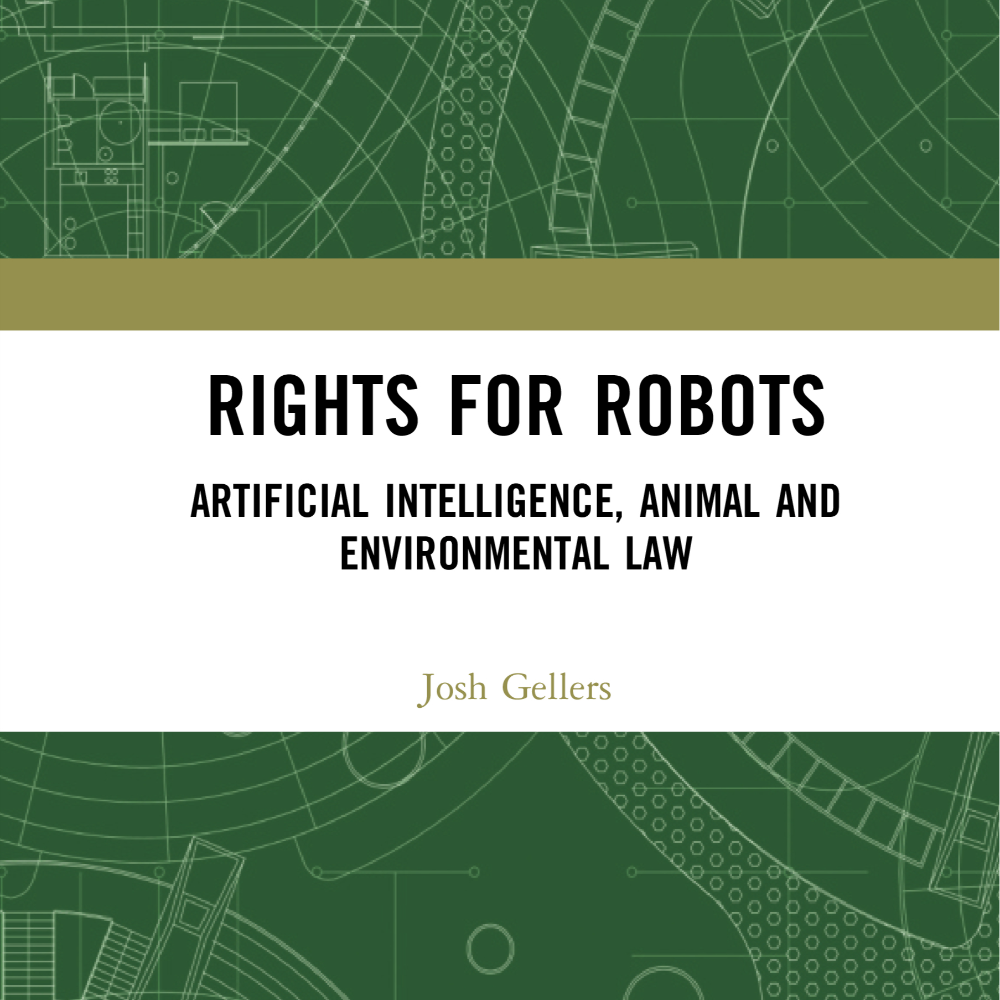

- Rights for Robots: Artificial Intelligence, Animal, and Environmental Law
- {:height 388, :width 377}
- Gellers, J. (2020). *Rights for Robots: Artificial Intelligence, Animal and Environmental Law*. Routledge.
- Introduction
	-