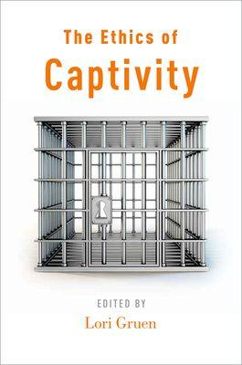

public:: false

- The Ethics of Captivity #captivity #powerdynamics #animals #ethics
- {:height 367, :width 237}
- Horowitz, A. (2014). __Canis familiaris: Companion and Captive.__ In _The Ethics of Captivity_ (pp. 7–21). Oxford University Press.
	- "The very process of artificial selection holds dogs captive, tethered to persons in body and mind. As a species, consideration of the morality of keeping dogs captive is no longer relevant: without this captivity, domestic dogs would not exist." (pp. 13)
	- "Those breed members unlucky enough to be the genetic inheritors of these conditions are held captive by their own bodies. Humans have enabled this unfortunate circumstances." (talking about breed inheriting physical disorders, pp. 13)
	- "[...] Hediger expresses concern for animal's 'isolation through captivity'. In typical contemporary dog-owning practices, owners risk creating 'captivity through isolation'." (pp. 17)
- Marino, L. (2014). __Cetacean Captivity.__ In _The Ethics of Captivity_ (pp. 23–37). Oxford University Press.
	- "[...] cetacean intelligence, self-awareness, emotionality, and social complexity mean that they, like us, experience life as persons. But they move very differently, live in an exotic milieu, lack clear facial expressions, communicate in unfamiliar modalities, and always seem to be smiling (although this is just an anatomical illusion). These differences make it challenging for humans to recognize the similarities to us and their ability to suffer like us, and, thus, make it easier to objectify and exploit them." (pp. 23)
	- "Few animals have the revenue-earning potential of dolphins and whales." (pp. 27) #capitalism
- Doyle, C. (2014). __Captive Elephants.__ In _The Ethics of Captivity_ (pp. 38–56). Oxford University Press.
	- "Elephants share a surprising number of characteristics with humans, such as high intelligence, social complexity, long lives, long periods of infancy, and social learning of behaviors." (pp. 38-39)
- Ross, S. R. (2014). __Captive Chimpanzees.__ In _The Ethics of Captivity_ (pp. 57–76). Oxford University Press.
	- "In 1989, chimpanzees were uplisted to 'endangered' status but maintain the lesser 'threatened' status for captive chimpanzees, primarily to facilitate their use for medical research." (pp. 61)
-