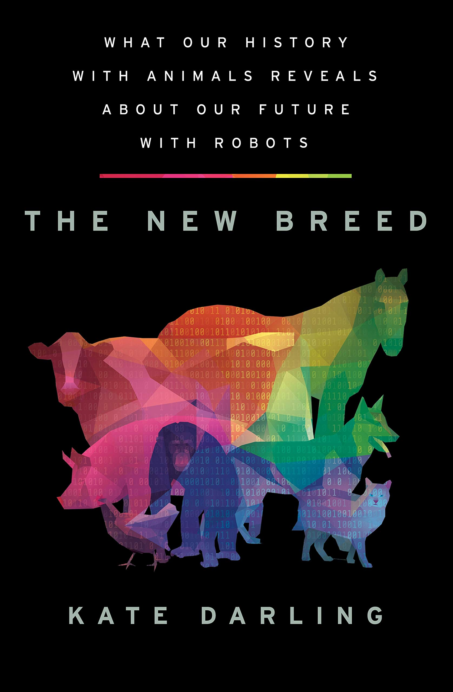

public:: true

- The New Breed: What our History with Animals Reveals About our Future with Robots
- {:height 486, :width 309}
- Darling, K. (2021). *The New Breed: What Our History with Animals Reveals about Our Future with Robots*. Henry Holt and Co.
- 3_ Violence, Empathy, and Rights
	- Western animal and robot rights theories
	- "But the stories that compare fictional future robots to humans don't fully capture the true messiness we will be facing if and when robot rights become topic. Instead, the history and current state of animal rights in the West is a more accurate and very different story for us to draw on. It's one that plainly lays bare how little we care about rights theories and how much of our treatment of nonhumans is, and will be, about what we relate to __emotionally__." (pp. 176) #affect
	- "But it strikes me that our conversations are too focused on humanlike robots, and that our approach to animal rights may be more predictive of how this will play out in our world." (pp. 179)
	- "Quite a few philosophers have made their animal rights theories about people [...]." (pp. 183) #anthropocentrism
	- "[...] if robots are performatively equivalent to something that already has moral status, we should give robots that status, too." (pp. 183) #ethics #rights
	- [...] philosopher Sven Nyholm criticizes the approach of making robot rights all about our relationships because it dismisses the criteria of suffering, happiness, or consent." (pp. 184) #interspeciesrelationship
	- Free Willy: Western animal rights in practice
	- "They adopted the indirect approach, and urged policy makers to protect animals for the sake of human behavior, arguing that enforcing kindness toward animals would encourage better societal norms." (pp. 189) #anthropocentrism
	- "[...] empathy has been a huge driver for animal rights activists." (pp. 190) #empathy
	  background-color:: green
	- "A lot of our rights thinking assumes that we care about biological criteria and scientific evidence, for example, when philosophers contend that we should treat robots according to their actual abilities. [...] our actual activism has rarely happened without sentiment and passion - and a fair share of bias." (pp. 193) #empathy #science
	- "Some animal welfare supporters believe that empathy toward animals relies on an anthropomorphic view, and that empathy is the only thing that can drive us to morally correct position." (pp. 198) #empathy #anthropomorphism
	- Don't kick the robot
	- "I also wanted to know whether projecting life onto robots could make us feel that they deserve moral consideration." (pp. 210) #rights #robots
	- "Their pushback struck me as remarkably similar to what the early Western animal rights movement encountered: people were on board with the idea that it felt wrong to be cruel to animals, but they balked at creating legal rules because that would be going too far." (pp. 211) #rights
	- "In fact, the issues of cruelty toward animals and cruelty toward children were so closely related around the turn of the twentieth century that over half of all organizations against animal cruelty fought for humane treatment of children as well. [...] Violence toward animals has also been connected to domestic abuse and other interpersonal violence." (pp. 217)
	- "If you ask most people today, they'll tell you that robots are just machines. It's just like the sixteenth-century Cartesian view of animals as complex automata. But what makes this comparison so interesting to me isn't only the similarities - it's also where there should be differences. We know today that animals can feel and suffer in ways that our machines can't. But even though we understand this intellectually, we still treat most animals no differently than machines. __What if juxtaposing animals and robots could change that?__" (pp. 221) #animalmachine
	  background-color:: yellow
	- "Our empathy is complex, self-serving, and sometimes incredibly misguided, but I'm not convinced that it's a bad thing." (pp. 225) #empathy