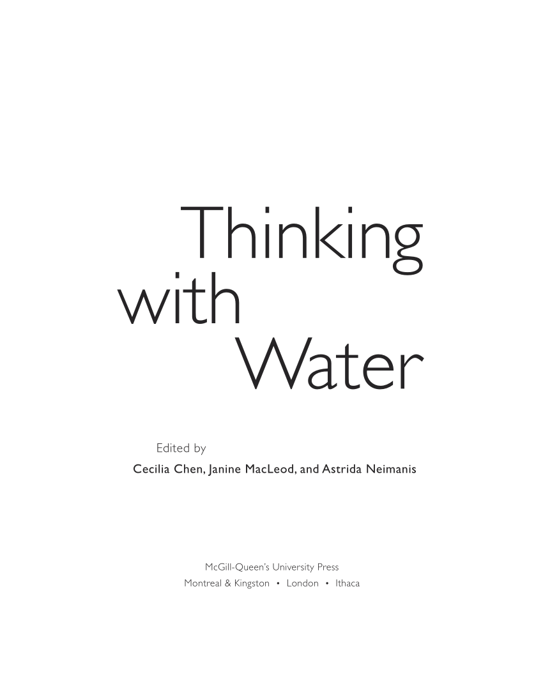

public:: false

- [[Sound Waterwheel]]
- Thinking with Water #capitalism #water #memory
	- {:height 372, :width 287}
	- MacLeod, J. (2013). __Water and the Material Imagination: Reading the Sea of Memory against the Flow of Capital.__ In *Thinking with Water* (1st ed., pp. 40–60). McGill-Queen’s University Press.
		- "The 'flows of capital' metaphor contributes to the aura of naturalness surrounding such conditions" (pp. 41)
		- "[...] technical control over the flow of large rivers has often coincided with intensified social domination; the construction of mega-dams and other large-scale waterworks has both required and facilitated more pronounced social hierarchy and a great concentration of power" (pp. 42) #powerdynamics #power #hierarchies
		- "As such, modern modes of communication tend to disconnect individual events from one another and allow the links between generations to atrophy. In fragmenting and decontextualizing events, this mode of temporal experience also hinders our ability to perceive and understand environmental threats" (pp. 44) #climatechange #fragmentation
		- "Water quite literally binds together the 'little separate incidents' of life" (pp. 47) #water
		- "[...] the commodity form reduces all objects to a single quantified abstraction. In this process of simplification, the commodity form diminishes the complexity of every ecosystem it touches." (pp. 49) #commodity #ecosystem #capitalism
		- "As they are exploited, for instance, to sell bottled water, real estate, and package tours, water's symbolic resonances of well-being, prosperity, serenity, or power may be associatively linked to the markets in which they circulates." (pp. 54) #capitalism #water
		- "The vitality of multi-generational memory and the well-being of the water commons are threatened by the same operations of capital." (pp. 57) #capital #water #memory
	- Spiegel, J. B. (2013). __Subterranean Flows: Water Contamination and the Politics of Visibility after the Bhopal Disaster.__ In *Thinking with Water* (1st ed., pp. 84–103). McGill-Queen’s University Press.
		- "The globe is on our computers. No one lives there. It allows us to think that we can aim to control it." (pp. 85) #control #anthropocentrism
		- Trans-corporeality: "their [human] bodies are also in some sense indistinguishable from the ground water and the chemicals produced in the factory: the same flow of substances passes through all these bodies." (pp. 86)
		- "both planet and womb have tended to be flattened as material backdrops, viewed merely as offering fodder for the production of goods, as sites of exploitation whence the value-rich is put into circulation." (pp. 86) #hierarchies
		- "The hegemony of scientific practices has come under much attack from theorists who rightly point to the history of domination that it has served and the reductive epistemologies that it bolsters to give legitimacy to certain voices." (pp. 93 ) #supremacy
		- "the importance of water as the universal connector" (pp. 99) #interrelations
	- Roburn, S. (2013). __Sounding a Sea-Change: Acoustic Ecology and Arctic Ocean Governance.__ In *Thinking with Water* (1st ed., pp. 106–128). McGill-Queen’s University Press.
		- "Reframing the ocean as an acoustic space both highlights the speciesism inherent in human perceptions and categorizations of space, and reclassifies ocean habitats not as wild nature but as areas differentially affected by the pollution of modernity." (pp. 107) #speciesism
		- "suggesting an ethics of relationship that seeks through empathy to establish greater reciprocity with the more-than-human." (pp. 107) #more-than-human #empathy
		- "Successive waves of Western approaches to whaling - ranging from mass slaughter to outright ban - have been experienced by aboriginal peoples as expressions of oppresive colonial and post-colonial power relations, with outside forces disrupting subsistence harvests and challenging the validity of indigenous ethics and indigenous knowledge." (pp. 109) #colonialism
		- "Many of the noise effects he [Truax] categorizes - reduced acoustic space and shrinking acoustic horizons, increased physiological stress, masking effects, and changing communication patterns and definitions of comunity - speak directly to the condition of whales in modernity." (pp. 111) #noise
		- "The wide release of humpback whale songs in the 1970s was instrumental in generating a groundswell of empathy for whales as intelligent, sentient creatures." (pp. 117) #empathy
	- Alaimo, S. (2013). __Jellyfish Science, Jellyfish Aesthetics: Posthuman Reconfigurations of the Sensible.__ In *Thinking with Water* (1st ed., pp. 139–164). McGill-Queen’s University Press.
		- "I would like to argue that these aesthetic presentations of fluid forms of life can be understood as manifestations of care, wonder, and concern." (pp. 141) #care
		- "The confusion between creatures and artworks frames the flimsy gelata as valuable treasures that are worthy of consideration; the aesthetic response provokes a sense of aew and the impulse to protect. Nonetheless, the striking photographs of gelata and other sea creatures do, of course, invite the rather predictable, though vital, critique of their commodification." (pp. 151) #commodity
		- "The marvellous jellies, so immune to our interest, so utterly different from our primate and mammalian kin, challenge humans to imagine more fluid ontologies and more immanent and immediate modes of knowledge - literal absorption." (pp. pp. 154) #anthropocentrism
		- "Within the context of global capitalism, which calculates value of the ocean in the economic terms of 'goods and services' and the consumerist discourse that translates ocean life into 'seafood', aesthetic encounters may at least gesture toward a recognition that marine animals exist in and for themselves - even if they are unseen and unknown by terrestrial primates." (pp. 155) #capitalism #commodity
		- "Citton puts forth 'art' and 'social movements' as equivalent sites for the reconfiguration of the sensible." (pp. 156)
		- "If there is any group most likely to remain unseen and unheard it would, undoubtedly, be that of non-human creatures." (pp. 156) #interspeciesrelationship
		- "Democracy can only be conceived if it can freely traverse the now-dismantled border between science and politics, in order to add a series of new voices to the discussion, voices that have been inaudible up to now, although their clamor pretended to override all debate: the voice of nonhumans." (pp. 157) #interspeciesrelationship