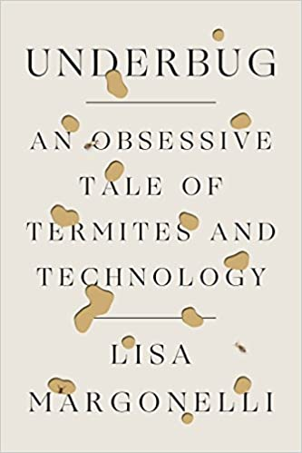

public:: true

- Underbug : An Obsessive Tale of Termites and Technology
- {:height 446, :width 292}
- Margonelli, L. (2018, August 21). *Underbug: An Obsessive Tale of Termites and Technology* (1st Edition). Scientific American / Farrar, Straus and Giroux.
- 1_ A Termite Safari
	- "They [the geneticists] were not here to appreciate termites; they were here to appropriate them." (pp. 5) #power #powerdynamics
	- "Termites have made the world by unmaking parts of it. They are the architects of negative space. The engineers of not." (pp. 9)
	- "Nobody loves termites, even though other social insects such as ants and bees are admired for their prganization, thrift, and industry." (pp. 9) #hierarchies
	- "Termites' offense is often described as the eating of 'private' property, which makes them sound like anticapitalist anarchists." (pp. 10) #capitalism
	- "This fits with our paradoxical desire to have a lighter footprint on the Earth while having a greater control over its processes." (pp. 11) #control
	  background-color:: #978626
- 2_ Riddles in the Dirt
	- "Marais called the termite mound a 'composite animal'." (pp. 22)
	- "The problem with social insects was that while single termites seem to be individuals, they do not function as such. " (pp. 23) #ecosystem
	- "Descartes's famous definition of animals as 'soulless automata'." (pp. 23)
	  background-color:: #978626
- 3_ An Inconvenient Insect
	- "The mount, Scott explained, looks like a fixed structure, but it is really a dynamic process. It's always falling down and rising up at the same time." (pp. 28)
	- "The concept of construction is very human and it ends with occupation. The process with termites is ongoing so that the structure morphs over time. It's never finished." (pp. 31)
- 4_ Into the Mound
	- "[...] the ability to cooperate is a powerful strategy for survival." (pp. 35) #cooperation
	  background-color:: #978626
	- "[...] altruism is a successful reproduction strategy if the genetic relationship between individuals and the benefit they derive from the altruism is greater than the cost of helping others." (pp. 36) #cooperation
	- "Termite and *Termitomyces* fungus are interrelated that it's hard to tell where the mushroom ends and the termite picks up, but within their codependence is some sort of frenemy-type rivalry." (pp. 41) #coexistence #ecosystem
	- "Prejudiced by our human sense of a hierarchy of the animate termites over inanimate mushrooms, we'd be inclined to believe that the termites control the fungus. But the fungus is physically much larger than the termites in size and energy production [...]." (pp. 41) #hierarchies #supremacy
	- "He saw this as a justification for aristocracy - in insects as in humans - 'ans nature has so ordered it'. In older texts about social insects, you can see them offered up equally as justifications for racism and as inspirations for utopias." (pp. 44) #hierarchies #whitesupremacy
- 5_ Complexity is the Essence
	- "Why do we say the termite is alive but not the mound?" (pp. 51)
- 6_ Because They Are So Sweet
	- "The role of joy in social organisms is not something we have a metric for, so it's not anything that modern biology entertains seriously." (pp. 54) #happiness
	- "Scientists more or less agree that termites have some sort of collective intelligence - they 'think' somehow as a swarm - but there isn't much agreement on whether they have individual intelligence." (pp. 57) #swarmintelligence
- 7_ A Black Bow with Six Legs
	- "The idea that termites can be thought of as robots - or, more generally, that all nonhuman animals are robots - goes back to rené Descartes, who died in 1605. It was Descartes who described animal as 'soulless automata', in contrast to humans, who had souls, minds, and intentions." (pp. 68) #interspeciesrelationship #hierarchies
- 9_ The Second Termite Safari
	- "[...] but, like calling termites robots, it contains contradictions and paradoxes." (pp. 83)
	- "[...] probably none of the geneticists could really imagine a living being without rights." (pp. 94)
- 11_ Jazz in the Metagenome
	- "[...] the termite's gut is another composite animal made of millions of bacteria [...]" (pp. 110)
- 12_ Burning Very Slowly
	- "The more I thought about this, the more I wondered if we focus too much on the inventions-the fertilizers, the biofuel, and even the wellhead itself-rather than the systems of power that grow around them." (pp. 126) #powerdynamics
- 14_ Crossing the Abstraction Barrier
	- "They even have a sort of electronic boredomL they'll repeat motions three times to try to get it right, but after that they give up." (pp. 137)
	- "I have lazily thought of robots as 'smart'. But no one wants a robot that really thinks. We want reliable ones that can do complicated jobs thousands of times without mistakes." (pp. 139) #intelligence #robots
	- "One way to further abstract the robots' reasoning is to make their environment and even the blocks themselves smart." (pp. 139)
	- "Robots will only be part of our lives when we don't need PhDs to run them and they can make their own power." (pp. 141) #robots
	- "The Kilobots are goofy as individuals but sophisticated as a group, making something just short of a robotic superorganism." (pp. 143) #swarmintelligence
- 15_ Influential Individuals
	- "What she discovered was that the bugs did not act like robots at all! [...] the termites were individuals, with personalities." (pp. 148) #individual #insect
	  background-color:: yellow
	- "Kirstin's termites were not the downtrodden drones of a totalitarian assembly line, but something more like the well-kept residents of a Danish socialist village-each contributing in its own way." (pp. 151)
	- "Fish, in other words, have evolved collective strategies that reduce the likelihood of following a really eccentric fish with a bad idea, which is something humans might want to look into." (pp. 153)
	- "But Kirstin's data revealed a world that was more intuitive-more gooey, more individual, and less robotic-than the more mechanistic views of termites that humans had been able to imagine." (pp. 153) #individual
	  background-color:: green
	- "'The mechanistic view of life doesn't have room for minded things.' And yet, it was machines that had revealed this 'minded' world." (pp. 155)
	- "The termites had changed the way she thought about machines. 'I've reached the mindset that's much closer to the idea of constructing a society than three robots who can make stuff together.'" (pp. 158) #society #swarmintelligence
	- "I'd like to make a lot of really dumb robots. Whoever gets the sensory information becomes the leader. Over time they will forget that they're dumb." (pp. 158)
-