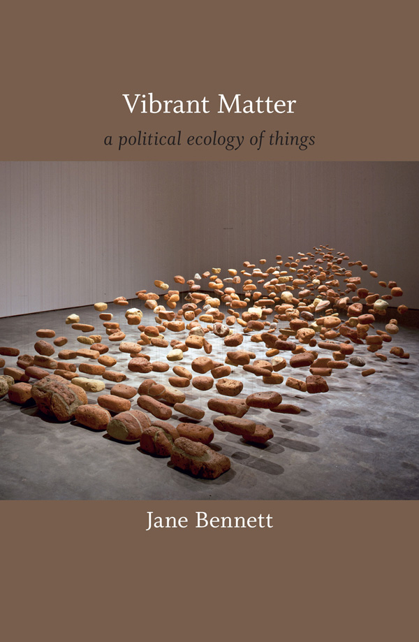

public:: true

- Vibrant Matter: A Political Ecology of Things
- {:height 472, :width 293}
- Bennett, J. (2010). *Vibrant Matter: A Political Ecology of Things*. Duke University Press.
- Preface
- "The quarantines of matter and life encourage us to ignore the vitality _of_ matter and the lively powers _of_ material formations [...]." #lifematter
- "How would political responses to public problems change were we to take seriously the vitality of (nonhuman) bodies?" #nonhuman #politics #biopolitics
- "The term is Bruno Latour's: an actant is a source of action that can be either human or nonhuman; it is that which has efficacy, can _do_ things, has sufficient coherence to make a difference, produce effects, alter the source of events." #nonhuman #actant
- "Why advocate the vitality of matter? Because my hunch is that the image of dead or thoroughly instrumentalized matter feeds human hubris and our earth-destroying fantasies of conquest and consumption. It does so by preventing us from detecting (seeing, hearing, smelling, tasting, feeling) a fuller range of the nonhuman powers circulating around and within human bodies." #nonhuman #vitalmaterialism
-